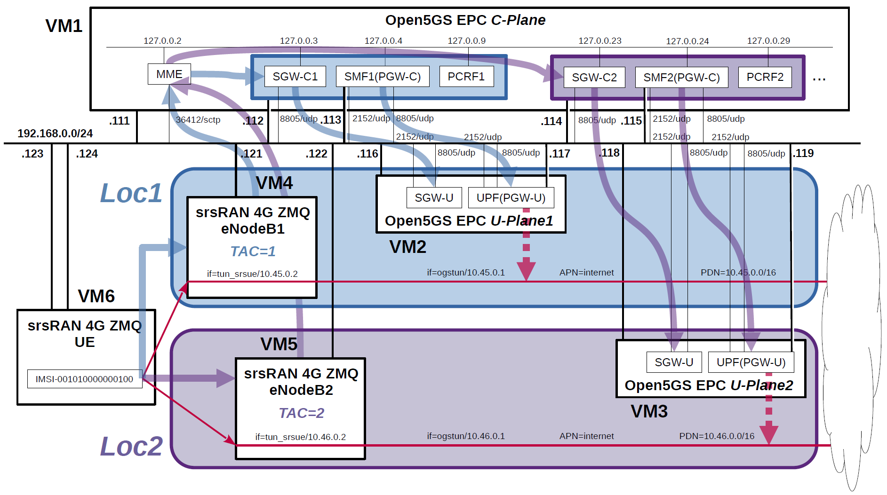

# Open5GS EPC & srsRAN 4G with ZeroMQ UE / RAN Sample Configuration - Select nearby UPF(PGW-U) according to the connected eNodeB
On 2023.05.05, Open5GS MME has a facility to select SMF(PGW-C) by TAC and e_CellID.
Therefore I describe a very simple configuration that uses Open5GS and srsRAN 4G to select a nearby UPF(PGW-U) according to the connected eNodeB.

---

<h2 id="conf_list">List of Sample Configurations</h2>

1. [One SGW-C/PGW-C, one SGW-U/PGW-U and one APN](https://github.com/s5uishida/open5gs_epc_srsran_sample_config)
2. [One SGW-C/PGW-C, Multiple SGW-Us/PGW-Us and APNs](https://github.com/s5uishida/open5gs_epc_oai_sample_config)
3. [One SMF, Multiple UPFs and DNNs](https://github.com/s5uishida/open5gs_5gc_ueransim_sample_config)
4. Select nearby UPF(PGW-U) according to the connected eNodeB (this article)
5. [Select nearby UPF according to the connected gNodeB](https://github.com/s5uishida/open5gs_5gc_ueransim_nearby_upf_sample_config)
6. [Select UPF based on S-NSSAI](https://github.com/s5uishida/open5gs_5gc_ueransim_snssai_upf_sample_config)
7. [SCP Indirect communication Model C](https://github.com/s5uishida/open5gs_5gc_ueransim_scp_model_c_sample_config)
8. [VoLTE and SMS Configuration for docker_open5gs](https://github.com/s5uishida/docker_open5gs_volte_sms_config)
9. [Monitoring Metrics with Prometheus](https://github.com/s5uishida/open5gs_5gc_ueransim_metrics_sample_config)
10. [Framed Routing](https://github.com/s5uishida/open5gs_5gc_ueransim_framed_routing_sample_config)

---

<h2 id="misc">Miscellaneous Notes</h2>

- [Install MongoDB 6.0 and Open5GS WebUI](https://github.com/s5uishida/open5gs_install_mongodb6_webui)
- [Build srsRAN 4G UE / RAN with ZeroMQ by disabling RF plugins](https://github.com/s5uishida/build_srsran_4g_zmq_disable_rf_plugins)

---

<h2 id="toc">Table of Contents</h2>

- [Overview of Open5GS CUPS-enabled EPC Simulation Mobile Network](#overview)
- [Changes in configuration files of Open5GS EPC and srsRAN 4G ZMQ UE / RAN](#changes)
  - [Changes in configuration files of Open5GS EPC C-Plane](#changes_cp)
  - [Changes in configuration files of Open5GS EPC U-Plane1](#changes_up1)
  - [Changes in configuration files of Open5GS EPC U-Plane2](#changes_up2)
  - [Changes in configuration files of srsRAN 4G ZMQ UE / RAN](#changes_srs)
    - [Changes in configuration files of RAN (eNodeB1)](#changes_ran1)
    - [Changes in configuration files of RAN (eNodeB2)](#changes_ran2)
    - [Changes in configuration files of UE for Loc1 (IMSI-001010000000100)](#changes_ue_loc1)
    - [Changes in configuration files of UE for Loc2 (IMSI-001010000000100)](#changes_ue_loc2)
- [Network settings of Open5GS EPC and srsRAN 4G ZMQ UE / RAN](#network_settings)
  - [Network settings of Open5GS EPC C-Plane](#network_settings_cp)
  - [Network settings of Open5GS EPC U-Plane1](#network_settings_up1)
  - [Network settings of Open5GS EPC U-Plane2](#network_settings_up2)
  - [Network settings of srsRAN 4G ZMQ UE](#network_settings_ue)
- [Build Open5GS and srsRAN 4G ZMQ UE / RAN](#build)
- [Run Open5GS EPC and srsRAN 4G ZMQ UE / RAN](#run)
  - [Run Open5GS EPC C-Plane](#run_cp)
  - [Run Open5GS EPC U-Plane1 & U-Plane2](#run_up)
  - [Confirm in Loc1 (TAC=1)](#confirm_loc1)
    - [Run srsRAN 4G ZMQ RAN (eNodeB1) with TAC=1 in Loc1](#run_ran1)
    - [Run srsRAN 4G ZMQ UE (ue-loc1.conf) connected to eNodeB1 in Loc1](#run_ue1)
    - [Ping google.com going through PDN=10.45.0.0/16 on Loc1](#ping_ue1)
  - [Confirm in Loc2 (TAC=2)](#confirm_loc2)
    - [Run srsRAN 4G ZMQ RAN (eNodeB2) with TAC=2 in Loc2](#run_ran2)
    - [Run srsRAN 4G ZMQ UE (ue-loc2.conf) connected to eNodeB2 in Loc2](#run_ue2)
    - [Ping google.com going through PDN=10.46.0.0/16 on Loc2](#ping_ue2)
- [Changelog (summary)](#changelog)

---
<h2 id="overview">Overview of Open5GS CUPS-enabled EPC Simulation Mobile Network</h2>

The following minimum configuration was set as a condition.
- The pair of eNodeB and SGW-U/UPF(PGW-U) exists in the same location.
- The UE connected to eNodeB connects to PDN managed by SGW-U/UPF(PGW-U) in the same location.

**In this example, TAC is matched to connect eNodeB and MME, and MME selects SGW-C/SMF(PGW-C) using TAC.**

The built simulation environment is as follows.

</img>

The EPC / UE / RAN used are as follows.
- EPC - Open5GS v2.6.3 (2023.05.06) - https://github.com/open5gs/open5gs
- UE / RAN - srsRAN 4G (2023.05.06) - https://github.com/srsran/srsRAN_4G

Each VMs are as follows.  
| VM# | SW & Role | IP address | OS | Memory (Min) | HDD (Min) |
| --- | --- | --- | --- | --- | --- |
| VM1 | Open5GS EPC C-Plane | 192.168.0.111/24 <br> 192.168.0.112/24 <br> 192.168.0.113/24 <br> 192.168.0.114/24 <br> 192.168.0.115/24 | Ubuntu 22.04 | 1GB | 20GB |
| VM2 | Open5GS EPC U-Plane1 | 192.168.0.116/24 <br> 192.168.0.117/24 | Ubuntu 22.04 | 1GB | 20GB |
| VM3 | Open5GS EPC U-Plane2 | 192.168.0.118/24 <br> 192.168.0.119/24 | Ubuntu 22.04 | 1GB | 20GB |
| VM4 | srsRAN 4G ZMQ RAN (eNodeB1) | 192.168.0.121/24 | Ubuntu 22.04 | 2GB | 10GB |
| VM5 | srsRAN 4G ZMQ RAN (eNodeB2) | 192.168.0.122/24 | Ubuntu 22.04 | 2GB | 10GB |
| VM6 | srsRAN 4G ZMQ UE | 192.168.0.123/24 <br> 192.168.0.124/24 | Ubuntu 22.04 | 2GB | 10GB |

MME, SGW-C, SMF(PGW-C) and PCRF addresses are as follows. 
| NF | IP address | Local address | Supported TACs |
| --- | --- | --- | --- |
| MME | 192.168.0.111 | 127.0.0.2 | 1, 2 |
| SGW-C1 | 192.168.0.112 | 127.0.0.3 | 1 |
| SMF1(PGW-C) | 192.168.0.113 | 127.0.0.4 | 1 |
| PCRF1 | -- | 127.0.0.9 | -- |
| SGW-C2 | 192.168.0.114 | 127.0.0.23 | 2 |
| SMF2(PGW-C) | 192.168.0.115 | 127.0.0.24 | 2 |
| PCRF2 | -- | 127.0.0.29 | -- |

The main information of eNodeBs is as follows.
| eNodeB# | Location# |IP address | MCC | MNC | TAC | eNodeB ID | Cell ID | E-UTRAN Cell ID |
| --- | --- | --- | --- | --- | --- | --- | --- | --- |
| eNodeB1 | Loc1 | 192.168.0.121 | 001 | 01 | 1 | 0x19b | 0x01 | 0x19b01 |
| eNodeB2 | Loc2 | 192.168.0.122 | 001 | 01 | 2 | 0x19c | 0x01 | 0x19c01 |

Subscriber Information (other information is the same) is as follows.  
| UE | IMSI | PDN | OP/OPc | eNodeB# | IP addres in ue.conf of srsRAN UE |
| --- | --- | --- | --- | --- | --- |
| UE | 001010000000100 | internet | OPc | eNodeB1 in Loc1 <br> eNodeB2 in Loc2 | 192.168.0.123 in ue-loc1.conf <br> 192.168.0.124 in ue-loc2.conf |

I registered these information with the Open5GS WebUI.
In addition, [3GPP TS 35.208](https://www.3gpp.org/DynaReport/35208.htm) "4.3 Test Sets" is published by 3GPP as test data for the 3GPP authentication and key generation functions (MILENAGE).

Each PDNs are as follows.
| PDN | Location# |  TUNnel interface of PDN | APN | TUNnel interface of UE | U-Plane# |
| --- | --- | --- | --- | --- | --- |
| 10.45.0.0/16 | Loc1 | ogstun | internet | tun_srsue | U-Plane1 |
| 10.46.0.0/16 | Loc2 | ogstun | internet | tun_srsue | U-Plane2 |

<h2 id="changes">Changes in configuration files of Open5GS EPC and srsRAN 4G ZMQ UE / RAN</h2>

Please refer to the following for building Open5GS and srsRAN 4G ZMQ UE / RAN respectively.
- Open5GS v2.6.3 (2023.05.06) - https://open5gs.org/open5gs/docs/guide/02-building-open5gs-from-sources/
- srsRAN 4G (2023.05.06) - https://docs.srsran.com/projects/4g/en/latest/

<h3 id="changes_cp">Changes in configuration files of Open5GS EPC C-Plane</h3>

- `open5gs/install/etc/open5gs/mme.yaml`
```diff
--- mme.yaml.orig       2023-05-05 15:56:45.724229388 +0900
+++ mme.yaml    2023-05-05 16:04:29.120235416 +0900
@@ -321,7 +321,7 @@
 mme:
     freeDiameter: /root/open5gs/install/etc/freeDiameter/mme.conf
     s1ap:
-      - addr: 127.0.0.2
+      - addr: 192.168.0.111
     gtpc:
       - addr: 127.0.0.2
     metrics:
@@ -329,15 +329,15 @@
         port: 9090
     gummei:
       plmn_id:
-        mcc: 999
-        mnc: 70
+        mcc: 001
+        mnc: 01
       mme_gid: 2
       mme_code: 1
     tai:
       plmn_id:
-        mcc: 999
-        mnc: 70
-      tac: 1
+        mcc: 001
+        mnc: 01
+      tac: [1, 2]
     security:
         integrity_order : [ EIA2, EIA1, EIA0 ]
         ciphering_order : [ EEA0, EEA1, EEA2 ]
@@ -407,6 +407,9 @@
 sgwc:
     gtpc:
       - addr: 127.0.0.3
+        tac: 1
+      - addr: 127.0.0.23
+        tac: 2
 
 #
 # smf:
@@ -470,9 +473,10 @@
 #       e_cell_id: [12345, a9413, 98765]
 smf:
     gtpc:
-      - addr:
-        - 127.0.0.4
-        - ::1
+      - addr: 127.0.0.4
+        tac: 1
+      - addr: 127.0.0.24
+        tac: 2
 
 #
 #  o Disable use of IPv4 addresses (only IPv6)
```
- `open5gs/install/etc/open5gs/sgwc1.yaml`
```diff
--- sgwc.yaml.orig      2023-04-30 00:53:20.000000000 +0900
+++ sgwc1.yaml  2023-05-03 10:50:12.000000000 +0900
@@ -20,7 +20,7 @@
 #    domain: core,sbi,ausf,event,tlv,mem,sock
 #
 logger:
-    file: /root/open5gs/install/var/log/open5gs/sgwc.log
+    file: /root/open5gs/install/var/log/open5gs/sgwc1.log
 
 #
 #  <GTP-C Server>
@@ -81,7 +81,7 @@
     gtpc:
       - addr: 127.0.0.3
     pfcp:
-      - addr: 127.0.0.3
+      - addr: 192.168.0.112
 
 #
 #  <PFCP Client>>
@@ -130,7 +130,8 @@
 #
 sgwu:
     pfcp:
-      - addr: 127.0.0.6
+      - addr: 192.168.0.116
+        apn: internet
 
 #
 #  o Disable use of IPv4 addresses (only IPv6)
```
- `open5gs/install/etc/open5gs/sgwc2.yaml`
```diff
--- sgwc.yaml.orig      2023-04-30 00:53:20.000000000 +0900
+++ sgwc2.yaml  2023-05-03 10:49:34.000000000 +0900
@@ -20,7 +20,7 @@
 #    domain: core,sbi,ausf,event,tlv,mem,sock
 #
 logger:
-    file: /root/open5gs/install/var/log/open5gs/sgwc.log
+    file: /root/open5gs/install/var/log/open5gs/sgwc2.log
 
 #
 #  <GTP-C Server>
@@ -79,9 +79,9 @@
 #
 sgwc:
     gtpc:
-      - addr: 127.0.0.3
+      - addr: 127.0.0.23
     pfcp:
-      - addr: 127.0.0.3
+      - addr: 192.168.0.114
 
 #
 #  <PFCP Client>>
@@ -130,7 +130,8 @@
 #
 sgwu:
     pfcp:
-      - addr: 127.0.0.6
+      - addr: 192.168.0.118
+        apn: internet
 
 #
 #  o Disable use of IPv4 addresses (only IPv6)
```
- `open5gs/install/etc/open5gs/smf1.yaml`
```diff
--- smf.yaml.orig       2023-04-30 00:53:20.000000000 +0900
+++ smf1.yaml   2023-05-03 10:51:06.000000000 +0900
@@ -20,7 +20,7 @@
 #    domain: core,sbi,ausf,event,tlv,mem,sock
 #
 logger:
-    file: /root/open5gs/install/var/log/open5gs/smf.log
+    file: /root/open5gs/install/var/log/open5gs/smf1.log
 
 #
 #  o TLS enable/disable
@@ -598,33 +598,24 @@
 #      maximum_integrity_protected_data_rate_downlink: bitrate64kbs|maximum-UE-rate
 #
 smf:
-    sbi:
-      - addr: 127.0.0.4
-        port: 7777
     pfcp:
-      - addr: 127.0.0.4
-      - addr: ::1
+      - addr: 192.168.0.113
     gtpc:
       - addr: 127.0.0.4
-      - addr: ::1
     gtpu:
-      - addr: 127.0.0.4
-      - addr: ::1
+      - addr: 192.168.0.113
     metrics:
       - addr: 127.0.0.4
         port: 9090
     subnet:
       - addr: 10.45.0.1/16
-      - addr: 2001:db8:cafe::1/48
     dns:
       - 8.8.8.8
       - 8.8.4.4
-      - 2001:4860:4860::8888
-      - 2001:4860:4860::8844
     mtu: 1400
     ctf:
       enabled: auto
-    freeDiameter: /root/open5gs/install/etc/freeDiameter/smf.conf
+    freeDiameter: /root/open5gs/install/etc/freeDiameter/smf1.conf
 
 #
 #  <SBI Client>>
@@ -690,10 +681,6 @@
 #          l_linger: 10
 #
 #
-scp:
-    sbi:
-      - addr: 127.0.1.10
-        port: 7777
 
 #
 #  <SBI Client>>
@@ -808,7 +795,8 @@
 #
 upf:
     pfcp:
-      - addr: 127.0.0.7
+      - addr: 192.168.0.117
+        dnn: internet
 
 #
 #  o Disable use of IPv4 addresses (only IPv6)
```
- `open5gs/install/etc/open5gs/smf2.yaml`
```diff
--- smf.yaml.orig       2023-04-30 00:53:20.000000000 +0900
+++ smf2.yaml   2023-05-03 10:51:32.000000000 +0900
@@ -20,7 +20,7 @@
 #    domain: core,sbi,ausf,event,tlv,mem,sock
 #
 logger:
-    file: /root/open5gs/install/var/log/open5gs/smf.log
+    file: /root/open5gs/install/var/log/open5gs/smf2.log
 
 #
 #  o TLS enable/disable
@@ -598,33 +598,24 @@
 #      maximum_integrity_protected_data_rate_downlink: bitrate64kbs|maximum-UE-rate
 #
 smf:
-    sbi:
-      - addr: 127.0.0.4
-        port: 7777
     pfcp:
-      - addr: 127.0.0.4
-      - addr: ::1
+      - addr: 192.168.0.115
     gtpc:
-      - addr: 127.0.0.4
-      - addr: ::1
+      - addr: 127.0.0.24
     gtpu:
-      - addr: 127.0.0.4
-      - addr: ::1
+      - addr: 192.168.0.115
     metrics:
-      - addr: 127.0.0.4
+      - addr: 127.0.0.24
         port: 9090
     subnet:
-      - addr: 10.45.0.1/16
-      - addr: 2001:db8:cafe::1/48
+      - addr: 10.46.0.1/16
     dns:
       - 8.8.8.8
       - 8.8.4.4
-      - 2001:4860:4860::8888
-      - 2001:4860:4860::8844
     mtu: 1400
     ctf:
       enabled: auto
-    freeDiameter: /root/open5gs/install/etc/freeDiameter/smf.conf
+    freeDiameter: /root/open5gs/install/etc/freeDiameter/smf2.conf
 
 #
 #  <SBI Client>>
@@ -690,10 +681,6 @@
 #          l_linger: 10
 #
 #
-scp:
-    sbi:
-      - addr: 127.0.1.10
-        port: 7777
 
 #
 #  <SBI Client>>
@@ -808,7 +795,8 @@
 #
 upf:
     pfcp:
-      - addr: 127.0.0.7
+      - addr: 192.168.0.119
+        dnn: internet
 
 #
 #  o Disable use of IPv4 addresses (only IPv6)
```
- `open5gs/install/etc/open5gs/pcrf1.yaml`
```diff
--- pcrf.yaml.orig      2023-04-30 00:53:20.000000000 +0900
+++ pcrf1.yaml  2023-05-03 11:22:28.000000000 +0900
@@ -22,10 +22,10 @@
 #    domain: core,sbi,ausf,event,tlv,mem,sock
 #
 logger:
-    file: /root/open5gs/install/var/log/open5gs/pcrf.log
+    file: /root/open5gs/install/var/log/open5gs/pcrf1.log
 
 pcrf:
-    freeDiameter: /root/open5gs/install/etc/freeDiameter/pcrf.conf
+    freeDiameter: /root/open5gs/install/etc/freeDiameter/pcrf1.conf
 
 #
 #  o Disable use of IPv4 addresses (only IPv6)
```
- `open5gs/install/etc/open5gs/pcrf2.yaml`
```diff
--- pcrf.yaml.orig      2023-04-30 00:53:20.000000000 +0900
+++ pcrf2.yaml  2023-05-03 11:23:00.000000000 +0900
@@ -22,10 +22,10 @@
 #    domain: core,sbi,ausf,event,tlv,mem,sock
 #
 logger:
-    file: /root/open5gs/install/var/log/open5gs/pcrf.log
+    file: /root/open5gs/install/var/log/open5gs/pcrf2.log
 
 pcrf:
-    freeDiameter: /root/open5gs/install/etc/freeDiameter/pcrf.conf
+    freeDiameter: /root/open5gs/install/etc/freeDiameter/pcrf2.conf
 
 #
 #  o Disable use of IPv4 addresses (only IPv6)
```
- `open5gs/install/etc/freeDiameter/smf1.conf`  
`smf1.conf` is equal to the original `smf.conf`.

- `open5gs/install/etc/freeDiameter/smf2.conf`
```diff
--- smf.conf.orig       2023-04-30 00:53:22.000000000 +0900
+++ smf2.conf   2023-05-03 11:20:46.000000000 +0900
@@ -79,7 +79,7 @@
 #ListenOn = "202.249.37.5";
 #ListenOn = "2001:200:903:2::202:1";
 #ListenOn = "fe80::21c:5ff:fe98:7d62%eth0";
-ListenOn = "127.0.0.4";
+ListenOn = "127.0.0.24";
 
 
 ##############################################################
@@ -261,7 +261,7 @@
 # Examples:
 #ConnectPeer = "aaa.wide.ad.jp";
 #ConnectPeer = "old.diameter.serv" { TcTimer = 60; TLS_old_method; No_SCTP; Port=3868; } ;
-ConnectPeer = "pcrf.localdomain" { ConnectTo = "127.0.0.9"; No_TLS; };
+ConnectPeer = "pcrf.localdomain" { ConnectTo = "127.0.0.29"; No_TLS; };
 
 
 ##############################################################
```
- `open5gs/install/etc/freeDiameter/pcrf1.conf`  
`pcrf1.conf` is equal to the original `pcrf.conf`.

- `open5gs/install/etc/freeDiameter/pcrf2.conf`
```diff
--- pcrf.conf.orig      2023-04-30 00:53:22.000000000 +0900
+++ pcrf2.conf  2023-05-07 18:32:04.246141671 +0900
@@ -79,7 +79,7 @@
 #ListenOn = "202.249.37.5";
 #ListenOn = "2001:200:903:2::202:1";
 #ListenOn = "fe80::21c:5ff:fe98:7d62%eth0";
-ListenOn = "127.0.0.9";
+ListenOn = "127.0.0.29";
 
 
 ##############################################################
@@ -261,6 +261,6 @@
 # Examples:
 #ConnectPeer = "aaa.wide.ad.jp";
 #ConnectPeer = "old.diameter.serv" { TcTimer = 60; TLS_old_method; No_SCTP; Port=3868; } ;
-ConnectPeer = "smf.localdomain" { ConnectTo = "127.0.0.4"; No_TLS; };
+ConnectPeer = "smf.localdomain" { ConnectTo = "127.0.0.24"; No_TLS; };
```

<h3 id="changes_up1">Changes in configuration files of Open5GS EPC U-Plane1</h3>

- `open5gs/install/etc/open5gs/sgwu.yaml`
```diff
--- sgwu.yaml.orig      2023-04-30 00:53:20.000000000 +0900
+++ sgwu.yaml   2023-05-03 10:54:32.000000000 +0900
@@ -114,9 +114,9 @@
 #
 sgwu:
     pfcp:
-      - addr: 127.0.0.6
+      - addr: 192.168.0.116
     gtpu:
-      - addr: 127.0.0.6
+      - addr: 192.168.0.116
 
 #
 #  <PFCP Client>>
```
- `open5gs/install/etc/open5gs/upf.yaml`
```diff
--- upf.yaml.orig       2023-04-30 00:53:20.000000000 +0900
+++ upf.yaml    2023-05-03 10:55:12.000000000 +0900
@@ -196,12 +196,13 @@
 #
 upf:
     pfcp:
-      - addr: 127.0.0.7
+      - addr: 192.168.0.117
     gtpu:
-      - addr: 127.0.0.7
+      - addr: 192.168.0.117
     subnet:
       - addr: 10.45.0.1/16
-      - addr: 2001:db8:cafe::1/48
+        dnn: internet
+        dev: ogstun
     metrics:
       - addr: 127.0.0.7
         port: 9090
```

<h3 id="changes_up2">Changes in configuration files of Open5GS EPC U-Plane2</h3>

- `open5gs/install/etc/open5gs/sgwu.yaml`
```diff
--- sgwu.yaml.orig      2023-04-30 00:53:20.000000000 +0900
+++ sgwu.yaml   2023-05-03 10:56:36.000000000 +0900
@@ -114,9 +114,9 @@
 #
 sgwu:
     pfcp:
-      - addr: 127.0.0.6
+      - addr: 192.168.0.118
     gtpu:
-      - addr: 127.0.0.6
+      - addr: 192.168.0.118
 
 #
 #  <PFCP Client>>
```
- `open5gs/install/etc/open5gs/upf.yaml`
```diff
--- upf.yaml.orig       2023-04-30 00:53:20.000000000 +0900
+++ upf.yaml    2023-05-03 10:57:36.000000000 +0900
@@ -196,12 +196,13 @@
 #
 upf:
     pfcp:
-      - addr: 127.0.0.7
+      - addr: 192.168.0.119
     gtpu:
-      - addr: 127.0.0.7
+      - addr: 192.168.0.119
     subnet:
-      - addr: 10.45.0.1/16
-      - addr: 2001:db8:cafe::1/48
+      - addr: 10.46.0.1/16
+        dnn: internet
+        dev: ogstun
     metrics:
       - addr: 127.0.0.7
         port: 9090
```

<h3 id="changes_srs">Changes in configuration files of srsRAN 4G ZMQ UE / RAN</h3>

<h4 id="changes_ran1">Changes in configuration files of RAN (eNodeB1)</h4>

- `srsRAN_4G/build/srsenb/enb.conf`
```diff
--- enb.conf.example    2023-05-02 10:51:20.000000000 +0900
+++ enb.conf    2023-05-03 11:39:50.000000000 +0900
@@ -22,9 +22,9 @@
 enb_id = 0x19B
 mcc = 001
 mnc = 01
-mme_addr = 127.0.1.100
-gtp_bind_addr = 127.0.1.1
-s1c_bind_addr = 127.0.1.1
+mme_addr = 192.168.0.111
+gtp_bind_addr = 192.168.0.121
+s1c_bind_addr = 192.168.0.121
 s1c_bind_port = 0
 n_prb = 50
 #tm = 4
@@ -80,8 +80,8 @@
 #time_adv_nsamples = auto
 
 # Example for ZMQ-based operation with TCP transport for I/Q samples
-#device_name = zmq
-#device_args = fail_on_disconnect=true,tx_port=tcp://*:2000,rx_port=tcp://localhost:2001,id=enb,base_srate=23.04e6
+device_name = zmq
+device_args = fail_on_disconnect=true,tx_port=tcp://192.168.0.121:2000,rx_port=tcp://192.168.0.123:2001,id=enb,base_srate=23.04e6
 
 #####################################################################
 # Packet capture configuration
```
- `srsRAN_4G/build/srsenb/rr.conf`
```diff
--- rr.conf.example     2023-05-02 10:51:20.000000000 +0900
+++ rr.conf     2023-05-02 11:52:54.000000000 +0900
@@ -55,7 +55,7 @@
   {
     // rf_port = 0;
     cell_id = 0x01;
-    tac = 0x0007;
+    tac = 0x0001;
     pci = 1;
     // root_seq_idx = 204;
     dl_earfcn = 3350;
```

<h4 id="changes_ran2">Changes in configuration files of RAN (eNodeB2)</h4>

- `srsRAN_4G/build/srsenb/enb.conf`
```diff
--- enb.conf.example    2023-05-02 10:51:20.000000000 +0900
+++ enb.conf    2023-05-05 16:47:30.000000000 +0900
@@ -19,12 +19,12 @@
 #
 #####################################################################
 [enb]
-enb_id = 0x19B
+enb_id = 0x19C
 mcc = 001
 mnc = 01
-mme_addr = 127.0.1.100
-gtp_bind_addr = 127.0.1.1
-s1c_bind_addr = 127.0.1.1
+mme_addr = 192.168.0.111
+gtp_bind_addr = 192.168.0.122
+s1c_bind_addr = 192.168.0.122
 s1c_bind_port = 0
 n_prb = 50
 #tm = 4
@@ -80,8 +80,8 @@
 #time_adv_nsamples = auto
 
 # Example for ZMQ-based operation with TCP transport for I/Q samples
-#device_name = zmq
-#device_args = fail_on_disconnect=true,tx_port=tcp://*:2000,rx_port=tcp://localhost:2001,id=enb,base_srate=23.04e6
+device_name = zmq
+device_args = fail_on_disconnect=true,tx_port=tcp://192.168.0.122:2000,rx_port=tcp://192.168.0.124:2001,id=enb,base_srate=23.04e6
 
 #####################################################################
 # Packet capture configuration
```
- `srsRAN_4G/build/srsenb/rr.conf`
```diff
--- rr.conf.example     2023-05-02 10:51:20.000000000 +0900
+++ rr.conf     2023-05-03 11:33:58.000000000 +0900
@@ -55,7 +55,7 @@
   {
     // rf_port = 0;
     cell_id = 0x01;
-    tac = 0x0007;
+    tac = 0x0002;
     pci = 1;
     // root_seq_idx = 204;
     dl_earfcn = 3350;
```

<h4 id="changes_ue_loc1">Changes in configuration files of UE for Loc1 (IMSI-001010000000100)</h4>

- `srsRAN_4G/build/srsue/ue-loc1.conf`
```diff
--- ue.conf.example     2023-05-05 16:18:12.000000000 +0900
+++ ue-loc1.conf        2023-05-03 11:35:38.000000000 +0900
@@ -42,8 +42,8 @@
 #continuous_tx     = auto
 
 # Example for ZMQ-based operation with TCP transport for I/Q samples
-#device_name = zmq
-#device_args = tx_port=tcp://*:2001,rx_port=tcp://localhost:2000,id=ue,base_srate=23.04e6
+device_name = zmq
+device_args = tx_port=tcp://192.168.0.123:2001,rx_port=tcp://192.168.0.121:2000,id=ue,base_srate=23.04e6
 
 #####################################################################
 # EUTRA RAT configuration
@@ -139,9 +139,9 @@
 [usim]
 mode = soft
 algo = milenage
-opc  = 63BFA50EE6523365FF14C1F45F88737D
-k    = 00112233445566778899aabbccddeeff
-imsi = 001010123456780
+opc  = E8ED289DEBA952E4283B54E88E6183CA
+k    = 465B5CE8B199B49FAA5F0A2EE238A6BC
+imsi = 001010000000100
 imei = 353490069873319
 #reader =
 #pin  = 1234
@@ -180,8 +180,8 @@
 #                      Supported: 0 - NULL, 1 - Snow3G, 2 - AES, 3 - ZUC
 #####################################################################
 [nas]
-#apn = internetinternet
-#apn_protocol = ipv4
+apn = internet
+apn_protocol = ipv4
 #user = srsuser
 #pass = srspass
 #force_imsi_attach = false
```

<h4 id="changes_ue_loc2">Changes in configuration files of UE for Loc2 (IMSI-001010000000100)</h4>

- `srsRAN_4G/build/srsue/ue-loc2.conf`
```diff
--- ue.conf.example     2023-05-05 16:18:12.000000000 +0900
+++ ue-loc2.conf        2023-05-05 16:33:18.000000000 +0900
@@ -42,8 +42,8 @@
 #continuous_tx     = auto
 
 # Example for ZMQ-based operation with TCP transport for I/Q samples
-#device_name = zmq
-#device_args = tx_port=tcp://*:2001,rx_port=tcp://localhost:2000,id=ue,base_srate=23.04e6
+device_name = zmq
+device_args = tx_port=tcp://192.168.0.124:2001,rx_port=tcp://192.168.0.122:2000,id=ue,base_srate=23.04e6
 
 #####################################################################
 # EUTRA RAT configuration
@@ -139,9 +139,9 @@
 [usim]
 mode = soft
 algo = milenage
-opc  = 63BFA50EE6523365FF14C1F45F88737D
-k    = 00112233445566778899aabbccddeeff
-imsi = 001010123456780
+opc  = E8ED289DEBA952E4283B54E88E6183CA
+k    = 465B5CE8B199B49FAA5F0A2EE238A6BC
+imsi = 001010000000100
 imei = 353490069873319
 #reader =
 #pin  = 1234
@@ -180,8 +180,8 @@
 #                      Supported: 0 - NULL, 1 - Snow3G, 2 - AES, 3 - ZUC
 #####################################################################
 [nas]
-#apn = internetinternet
-#apn_protocol = ipv4
+apn = internet
+apn_protocol = ipv4
 #user = srsuser
 #pass = srspass
 #force_imsi_attach = false
```

<h2 id="network_settings">Network settings of Open5GS EPC and srsRAN 4G ZMQ UE / RAN</h2>

<h3 id="network_settings_cp">Network settings of Open5GS EPC C-Plane</h3>

Add IP addresses for SGW-C1/SMF1(PGW-C) and SGW-C2/SMF2(PGW-C).
```
ip addr add 192.168.0.112/24 dev enp0s8
ip addr add 192.168.0.113/24 dev enp0s8
ip addr add 192.168.0.114/24 dev enp0s8
ip addr add 192.168.0.115/24 dev enp0s8
```
**Note. `enp0s8` is the network interface of `192.168.0.0/24` in my VirtualBox environment.
Please change it according to your environment.**

<h3 id="network_settings_up1">Network settings of Open5GS EPC U-Plane1</h3>

First, uncomment the next line in the `/etc/sysctl.conf` file and reflect it in the OS.
```
net.ipv4.ip_forward=1
```
```
# sysctl -p
```
Next, add IP address for UPF(PGW-U) and configure the TUNnel interface and NAPT.
```
ip addr add 192.168.0.117/24 dev enp0s8

ip tuntap add name ogstun mode tun
ip addr add 10.45.0.1/16 dev ogstun
ip link set ogstun up

iptables -t nat -A POSTROUTING -s 10.45.0.0/16 ! -o ogstun -j MASQUERADE
```

<h3 id="network_settings_up2">Network settings of Open5GS EPC U-Plane2</h3>

First, uncomment the next line in the `/etc/sysctl.conf` file and reflect it in the OS.
```
net.ipv4.ip_forward=1
```
```
# sysctl -p
```
Next, add IP address for UPF(PGW-U) and configure the TUNnel interface and NAPT.
```
ip addr add 192.168.0.119/24 dev enp0s8

ip tuntap add name ogstun mode tun
ip addr add 10.46.0.1/16 dev ogstun
ip link set ogstun up

iptables -t nat -A POSTROUTING -s 10.46.0.0/16 ! -o ogstun -j MASQUERADE
```

<h3 id="network_settings_ue">Network settings of srsRAN 4G ZMQ UE</h3>

Add IP address for UE in Loc2.
```
ip addr add 192.168.0.124/24 dev enp0s8
```

<h2 id="build">Build Open5GS and srsRAN 4G ZMQ UE / RAN</h2>

Please refer to the following for building Open5GS and srsRAN 4G ZMQ UE / RAN respectively.
- Open5GS v2.6.3 (2023.05.06) - https://open5gs.org/open5gs/docs/guide/02-building-open5gs-from-sources/
- srsRAN 4G (2023.05.06) - https://docs.srsran.com/projects/4g/en/latest/

Install MongoDB on Open5GS EPC C-Plane machine.
It is not necessary to install MongoDB on Open5GS EPC U-Plane machines.
[MongoDB Compass](https://www.mongodb.com/products/compass) is a convenient tool to look at the MongoDB database.
**See also [this](https://github.com/s5uishida/build_srsran_4g_zmq_disable_rf_plugins) for building srsRAN 4G.**

<h2 id="run">Run Open5GS EPC and srsRAN 4G ZMQ UE / RAN</h2>

I will confirm in the following scenario.
The reasons to confirm in such a scenario are as follows:

**[The reason for Open5GS](https://github.com/open5gs/open5gs/issues/1791)**
- In the current Open5GS, SGW changes occurs only at TAU/Handover.

**[The reason for srsRAN 4G with ZMQ](https://docs.srsran.com/projects/4g/en/latest/app_notes/source/zeromq/source/index.html#known-issues)**
- For a clean tear down, the UE needs to be terminated first, then the eNB.
- eNB and UE can only run once, after the UE has been detached, the eNB needs to be restarted.
- Currently a single eNB and a single UE are only supported.

**This scenario:**
```
1) EPC start

     C-Plane start
               |
               V
    U-Plane1 start
               |
               V
    U-Plane2 start

2) eNodeB1/UE(Loc1) start, ping and eNodeB1/UE(Loc1) stop

     eNodeB1 start
               |
               V
    UE(Loc1) start
               |
               V
             ping google.com -I tun_srsue -n
               |
               V
    UE(Loc1) stop
               |
               V
     eNodeB1 stop

3) MME restart

4) eNodeB2/UE(Loc2) start, ping and eNodeB2/UE(Loc2) stop

     eNodeB2 start
               |
               V
    UE(Loc2) start
               |
               V
             ping google.com -I tun_srsue -n
               |
               V
    UE(Loc2) stop
               |
               V
     eNodeB2 stop
```

<h3 id="run_cp">Run Open5GS EPC C-Plane</h3>

First, run Open5GS EPC C-Plane.

- Open5GS EPC C-Plane
```
./install/bin/open5gs-mmed &
./install/bin/open5gs-sgwcd -c install/etc/open5gs/sgwc1.yaml &
./install/bin/open5gs-sgwcd -c install/etc/open5gs/sgwc2.yaml &
./install/bin/open5gs-smfd -c install/etc/open5gs/smf1.yaml &
./install/bin/open5gs-smfd -c install/etc/open5gs/smf2.yaml &
./install/bin/open5gs-hssd &
./install/bin/open5gs-pcrfd -c install/etc/open5gs/pcrf1.yaml &
./install/bin/open5gs-pcrfd -c install/etc/open5gs/pcrf2.yaml &
```

<h3 id="run_up">Run Open5GS EPC U-Plane1 & U-Plane2</h3>

Next, run Open5GS EPC U-Planes.

- Open5GS EPC U-Plane1
```
./install/bin/open5gs-sgwud &
./install/bin/open5gs-upfd &
```
- Open5GS EPC U-Plane2
```
./install/bin/open5gs-sgwud &
./install/bin/open5gs-upfd &
```
Then run `tcpdump` on one more terminal for each U-Plane.
- Run `tcpdump` on VM2 (U-Plane1)
```
# tcpdump -i ogstun -n
tcpdump: verbose output suppressed, use -v[v]... for full protocol decode
listening on ogstun, link-type RAW (Raw IP), snapshot length 262144 bytes
```
- Run `tcpdump` on VM3 (U-Plane2)
```
# tcpdump -i ogstun -n
tcpdump: verbose output suppressed, use -v[v]... for full protocol decode
listening on ogstun, link-type RAW (Raw IP), snapshot length 262144 bytes
```

<h3 id="confirm_loc1">Confirm in Loc1 (TAC=1)</h3>

<h4 id="run_ran1">Run srsRAN 4G ZMQ RAN (eNodeB1) with TAC=1 in Loc1</h4>

Run srsRAN 4G ZMQ RAN (eNodeB1) and connect to Open5GS EPC.
```
# cd srsRAN_4G/build/srsenb
# ./src/srsenb enb.conf
---  Software Radio Systems LTE eNodeB  ---

Reading configuration file enb.conf...

Built in Release mode using commit 921f17484 on branch master.

Opening 1 channels in RF device=zmq with args=fail_on_disconnect=true,tx_port=tcp://192.168.0.121:2000,rx_port=tcp://192.168.0.123:2001,id=enb,base_srate=23.04e6
Supported RF device list: zmq file
CHx base_srate=23.04e6
CHx id=enb
Current sample rate is 1.92 MHz with a base rate of 23.04 MHz (x12 decimation)
CH0 rx_port=tcp://192.168.0.123:2001
CH0 tx_port=tcp://192.168.0.121:2000
CH0 fail_on_disconnect=true
Current sample rate is 11.52 MHz with a base rate of 23.04 MHz (x2 decimation)
Current sample rate is 11.52 MHz with a base rate of 23.04 MHz (x2 decimation)
Setting frequency: DL=2680.0 Mhz, UL=2560.0 MHz for cc_idx=0 nof_prb=50

==== eNodeB started ===
Type <t> to view trace
```
The Open5GS C-Plane log when executed is as follows.
```
05/07 18:43:23.317: [mme] INFO: eNB-S1 accepted[192.168.0.121]:49226 in s1_path module (../src/mme/s1ap-sctp.c:114)
05/07 18:43:23.317: [mme] INFO: eNB-S1 accepted[192.168.0.121] in master_sm module (../src/mme/mme-sm.c:106)
05/07 18:43:23.317: [mme] INFO: [Added] Number of eNBs is now 1 (../src/mme/mme-context.c:2194)
05/07 18:43:23.317: [mme] INFO: eNB-S1[192.168.0.121] max_num_of_ostreams : 30 (../src/mme/mme-sm.c:148)
```

<h4 id="run_ue1">Run srsRAN 4G ZMQ UE (ue-loc1.conf) connected to eNodeB1 in Loc1</h4>

Run srsRAN 4G ZMQ UE (ue-loc1.conf), connect to eNodeB1 in Loc1 and connect to Open5GS EPC.
```
# cd srsRAN_4G/build/srsue
# ./src/srsue ue-loc1.conf
Reading configuration file ue-loc1.conf...

Built in Release mode using commit 921f17484 on branch master.

Opening 1 channels in RF device=zmq with args=tx_port=tcp://192.168.0.123:2001,rx_port=tcp://192.168.0.121:2000,id=ue,base_srate=23.04e6
Supported RF device list: zmq file
CHx base_srate=23.04e6
CHx id=ue
Current sample rate is 1.92 MHz with a base rate of 23.04 MHz (x12 decimation)
CH0 rx_port=tcp://192.168.0.121:2000
CH0 tx_port=tcp://192.168.0.123:2001
Waiting PHY to initialize ... done!
Attaching UE...
Current sample rate is 1.92 MHz with a base rate of 23.04 MHz (x12 decimation)
Current sample rate is 1.92 MHz with a base rate of 23.04 MHz (x12 decimation)
.
Found Cell:  Mode=FDD, PCI=1, PRB=50, Ports=1, CP=Normal, CFO=-0.2 KHz
Current sample rate is 11.52 MHz with a base rate of 23.04 MHz (x2 decimation)
Current sample rate is 11.52 MHz with a base rate of 23.04 MHz (x2 decimation)
Found PLMN:  Id=00101, TAC=1
Random Access Transmission: seq=0, tti=181, ra-rnti=0x2
RRC Connected
Random Access Complete.     c-rnti=0x46, ta=0
Network attach successful. IP: 10.45.0.2
 nTp) 7/5/2023 9:44:12 TZ:99
```
The Open5GS C-Plane log when executed is as follows.
```
05/07 18:44:11.637: [mme] INFO: InitialUEMessage (../src/mme/s1ap-handler.c:232)
05/07 18:44:11.638: [mme] INFO: [Added] Number of eNB-UEs is now 1 (../src/mme/mme-context.c:4032)
05/07 18:44:11.638: [mme] INFO: Unknown UE by S_TMSI[G:2,C:1,M_TMSI:0xc0000404] (../src/mme/s1ap-handler.c:301)
05/07 18:44:11.638: [mme] INFO:     ENB_UE_S1AP_ID[1] MME_UE_S1AP_ID[1] TAC[1] CellID[0x19b01] (../src/mme/s1ap-handler.c:387)
05/07 18:44:11.638: [mme] INFO: Unknown UE by GUTI[G:2,C:1,M_TMSI:0xc0000404] (../src/mme/mme-context.c:2917)
05/07 18:44:11.638: [mme] INFO: [Added] Number of MME-UEs is now 1 (../src/mme/mme-context.c:2726)
05/07 18:44:11.638: [emm] INFO: [] Attach request (../src/mme/emm-sm.c:364)
05/07 18:44:11.638: [emm] INFO:     GUTI[G:2,C:1,M_TMSI:0xc0000404] IMSI[Unknown IMSI] (../src/mme/emm-handler.c:238)
05/07 18:44:11.685: [emm] INFO: Identity response (../src/mme/emm-sm.c:334)
05/07 18:44:11.685: [emm] INFO:     IMSI[001010000000100] (../src/mme/emm-handler.c:401)
05/07 18:44:11.788: [mme] INFO: [Added] Number of MME-Sessions is now 1 (../src/mme/mme-context.c:4046)
05/07 18:44:11.882: [sgwc] INFO: [Added] Number of SGWC-UEs is now 1 (../src/sgwc/context.c:237)
05/07 18:44:11.883: [sgwc] INFO: [Added] Number of SGWC-Sessions is now 1 (../src/sgwc/context.c:879)
05/07 18:44:11.883: [sgwc] INFO: UE IMSI[001010000000100] APN[internet] (../src/sgwc/s11-handler.c:237)
05/07 18:44:11.883: [gtp] INFO: gtp_connect() [127.0.0.4]:2123 (../lib/gtp/path.c:60)
05/07 18:44:11.884: [smf] INFO: [Added] Number of SMF-UEs is now 1 (../src/smf/context.c:1010)
05/07 18:44:11.884: [smf] INFO: [Added] Number of SMF-Sessions is now 1 (../src/smf/context.c:3051)
05/07 18:44:11.884: [smf] INFO: UE IMSI[001010000000100] APN[internet] IPv4[10.45.0.2] IPv6[] (../src/smf/s5c-handler.c:255)
05/07 18:44:11.888: [gtp] INFO: gtp_connect() [192.168.0.117]:2152 (../lib/gtp/path.c:60)
05/07 18:44:12.229: [emm] INFO: [001010000000100] Attach complete (../src/mme/emm-sm.c:1249)
05/07 18:44:12.229: [emm] INFO:     IMSI[001010000000100] (../src/mme/emm-handler.c:276)
05/07 18:44:12.229: [emm] INFO:     UTC [2023-05-07T09:44:12] Timezone[0]/DST[0] (../src/mme/emm-handler.c:282)
05/07 18:44:12.230: [emm] INFO:     LOCAL [2023-05-07T18:44:12] Timezone[32400]/DST[0] (../src/mme/emm-handler.c:286)
```
The Open5GS U-Plane1 log when executed is as follows.
```
05/07 18:44:11.882: [sgwu] INFO: UE F-SEID[UP:0xf60 CP:0xf27] (../src/sgwu/context.c:169)
05/07 18:44:11.882: [sgwu] INFO: [Added] Number of SGWU-Sessions is now 1 (../src/sgwu/context.c:174)
05/07 18:44:11.886: [upf] INFO: [Added] Number of UPF-Sessions is now 1 (../src/upf/context.c:206)
05/07 18:44:11.886: [gtp] INFO: gtp_connect() [192.168.0.116]:2152 (../lib/gtp/path.c:60)
05/07 18:44:11.886: [gtp] INFO: gtp_connect() [192.168.0.113]:2152 (../lib/gtp/path.c:60)
05/07 18:44:11.886: [upf] INFO: UE F-SEID[UP:0x88f CP:0xb52] APN[internet] PDN-Type[1] IPv4[10.45.0.2] IPv6[] (../src/upf/context.c:483)
05/07 18:44:11.886: [upf] INFO: UE F-SEID[UP:0x88f CP:0xb52] APN[internet] PDN-Type[1] IPv4[10.45.0.2] IPv6[] (../src/upf/context.c:483)
05/07 18:44:11.888: [gtp] INFO: gtp_connect() [192.168.0.117]:2152 (../lib/gtp/path.c:60)
05/07 18:44:12.229: [gtp] INFO: gtp_connect() [192.168.0.121]:2152 (../lib/gtp/path.c:60)
```
The result of `ip addr show` on VM6 (UE) is as follows.
```
# ip addr show
...
6: tun_srsue: <POINTOPOINT,MULTICAST,NOARP,UP,LOWER_UP> mtu 1500 qdisc fq_codel state UNKNOWN group default qlen 500
    link/none 
    inet 10.45.0.2/24 scope global tun_srsue
       valid_lft forever preferred_lft forever
...
```

<h4 id="ping_ue1">Ping google.com going through PDN=10.45.0.0/16 on Loc1</h4>

Confirm by using `tcpdump` that the packet goes through `if=ogstun` on U-Plane1.
```
# ping google.com -I tun_srsue -n
PING google.com (142.250.196.142) from 10.45.0.2 tun_srsue: 56(84) bytes of data.
64 bytes from 142.250.196.142: icmp_seq=1 ttl=61 time=89.1 ms
64 bytes from 142.250.196.142: icmp_seq=2 ttl=61 time=79.1 ms
64 bytes from 142.250.196.142: icmp_seq=3 ttl=61 time=63.6 ms
```
The `tcpdump` log on U-Plane1 is as follows.
```
18:45:39.866316 IP 10.45.0.2 > 142.250.196.142: ICMP echo request, id 7, seq 1, length 64
18:45:39.884281 IP 142.250.196.142 > 10.45.0.2: ICMP echo reply, id 7, seq 1, length 64
18:45:40.858609 IP 10.45.0.2 > 142.250.196.142: ICMP echo request, id 7, seq 2, length 64
18:45:40.876311 IP 142.250.196.142 > 10.45.0.2: ICMP echo reply, id 7, seq 2, length 64
18:45:41.847215 IP 10.45.0.2 > 142.250.196.142: ICMP echo request, id 7, seq 3, length 64
18:45:41.865368 IP 142.250.196.142 > 10.45.0.2: ICMP echo reply, id 7, seq 3, length 64
```
**Note. Make sure the packet does not go through U-Plane2. The UE connects to the PDN of U-Plane1 in the same Loc1 according to the connected eNodeB1 in Loc1.**

**After this, stop eNodeB1 and UE in preparation for confirming Loc2 with TAC=2.**

<h3 id="restart_mme">Restart Open5GS MME</h3>

Restart Open5GS MME in preparation for confirming Loc2 with TAC=2.
```
pkill open5gs-mmed
./install/bin/open5gs-mmed &
```

<h3 id="confirm_loc2">Confirm in Loc2 (TAC=2)</h3>

<h4 id="run_ran2">Run srsRAN 4G ZMQ RAN (eNodeB2) with TAC=2 in Loc2</h4>

Run srsRAN 4G ZMQ RAN (eNodeB2) and connect to Open5GS EPC.
```
# cd srsRAN_4G/build/srsenb
# ./src/srsenb enb.conf
---  Software Radio Systems LTE eNodeB  ---

Reading configuration file enb.conf...

Built in Release mode using commit 921f17484 on branch master.

Opening 1 channels in RF device=zmq with args=fail_on_disconnect=true,tx_port=tcp://192.168.0.122:2000,rx_port=tcp://192.168.0.124:2001,id=enb,base_srate=23.04e6
Supported RF device list: zmq file
CHx base_srate=23.04e6
CHx id=enb
Current sample rate is 1.92 MHz with a base rate of 23.04 MHz (x12 decimation)
CH0 rx_port=tcp://192.168.0.124:2001
CH0 tx_port=tcp://192.168.0.122:2000
CH0 fail_on_disconnect=true
Current sample rate is 11.52 MHz with a base rate of 23.04 MHz (x2 decimation)
Current sample rate is 11.52 MHz with a base rate of 23.04 MHz (x2 decimation)
Setting frequency: DL=2680.0 Mhz, UL=2560.0 MHz for cc_idx=0 nof_prb=50

==== eNodeB started ===
Type <t> to view trace
```
The Open5GS C-Plane log when executed is as follows.
```
05/07 18:48:20.449: [mme] INFO: eNB-S1 accepted[192.168.0.122]:32802 in s1_path module (../src/mme/s1ap-sctp.c:114)
05/07 18:48:20.449: [mme] INFO: eNB-S1 accepted[192.168.0.122] in master_sm module (../src/mme/mme-sm.c:106)
05/07 18:48:20.449: [mme] INFO: [Added] Number of eNBs is now 1 (../src/mme/mme-context.c:2194)
05/07 18:48:20.449: [mme] INFO: eNB-S1[192.168.0.122] max_num_of_ostreams : 30 (../src/mme/mme-sm.c:148)
```

<h4 id="run_ue2">Run srsRAN 4G ZMQ UE (ue-loc2.conf) connected to eNodeB2 in Loc2</h4>

Run srsRAN 4G ZMQ UE (ue-loc2.conf), connect to eNodeB2 in Loc2 and connect to Open5GS EPC.
```
# cd srsRAN_4G/build/srsue
# ./src/srsue ue-loc2.conf
Reading configuration file ue-loc2.conf...

Built in Release mode using commit 921f17484 on branch master.

Opening 1 channels in RF device=zmq with args=tx_port=tcp://192.168.0.124:2001,rx_port=tcp://192.168.0.122:2000,id=ue,base_srate=23.04e6
Supported RF device list: zmq file
CHx base_srate=23.04e6
CHx id=ue
Current sample rate is 1.92 MHz with a base rate of 23.04 MHz (x12 decimation)
CH0 rx_port=tcp://192.168.0.122:2000
CH0 tx_port=tcp://192.168.0.124:2001
Waiting PHY to initialize ... done!
Attaching UE...
Current sample rate is 1.92 MHz with a base rate of 23.04 MHz (x12 decimation)
Current sample rate is 1.92 MHz with a base rate of 23.04 MHz (x12 decimation)
.
Found Cell:  Mode=FDD, PCI=1, PRB=50, Ports=1, CP=Normal, CFO=-0.2 KHz
Current sample rate is 11.52 MHz with a base rate of 23.04 MHz (x2 decimation)
Current sample rate is 11.52 MHz with a base rate of 23.04 MHz (x2 decimation)
Found PLMN:  Id=00101, TAC=2
Random Access Transmission: seq=5, tti=181, ra-rnti=0x2
RRC Connected
Random Access Complete.     c-rnti=0x46, ta=0
Network attach successful. IP: 10.46.0.2
 nTp) 7/5/2023 9:49:20 TZ:99
```
The Open5GS C-Plane log when executed is as follows.
```
05/07 18:49:19.887: [mme] INFO: InitialUEMessage (../src/mme/s1ap-handler.c:232)
05/07 18:49:19.887: [mme] INFO: [Added] Number of eNB-UEs is now 1 (../src/mme/mme-context.c:4032)
05/07 18:49:19.887: [mme] INFO: Unknown UE by S_TMSI[G:2,C:1,M_TMSI:0xc0000404] (../src/mme/s1ap-handler.c:301)
05/07 18:49:19.887: [mme] INFO:     ENB_UE_S1AP_ID[1] MME_UE_S1AP_ID[1] TAC[2] CellID[0x19c01] (../src/mme/s1ap-handler.c:387)
05/07 18:49:19.887: [mme] INFO: Unknown UE by GUTI[G:2,C:1,M_TMSI:0xc0000404] (../src/mme/mme-context.c:2917)
05/07 18:49:19.887: [mme] INFO: [Added] Number of MME-UEs is now 1 (../src/mme/mme-context.c:2726)
05/07 18:49:19.887: [emm] INFO: [] Attach request (../src/mme/emm-sm.c:364)
05/07 18:49:19.887: [emm] INFO:     GUTI[G:2,C:1,M_TMSI:0xc0000404] IMSI[Unknown IMSI] (../src/mme/emm-handler.c:238)
05/07 18:49:19.936: [emm] INFO: Identity response (../src/mme/emm-sm.c:334)
05/07 18:49:19.937: [emm] INFO:     IMSI[001010000000100] (../src/mme/emm-handler.c:401)
05/07 18:49:20.080: [mme] INFO: [Added] Number of MME-Sessions is now 1 (../src/mme/mme-context.c:4046)
05/07 18:49:20.127: [sgwc] INFO: [Added] Number of SGWC-UEs is now 1 (../src/sgwc/context.c:237)
05/07 18:49:20.127: [sgwc] INFO: [Added] Number of SGWC-Sessions is now 1 (../src/sgwc/context.c:879)
05/07 18:49:20.127: [sgwc] INFO: UE IMSI[001010000000100] APN[internet] (../src/sgwc/s11-handler.c:237)
05/07 18:49:20.128: [gtp] INFO: gtp_connect() [127.0.0.24]:2123 (../lib/gtp/path.c:60)
05/07 18:49:20.129: [smf] INFO: [Added] Number of SMF-UEs is now 1 (../src/smf/context.c:1010)
05/07 18:49:20.129: [smf] INFO: [Added] Number of SMF-Sessions is now 1 (../src/smf/context.c:3051)
05/07 18:49:20.129: [smf] INFO: UE IMSI[001010000000100] APN[internet] IPv4[10.46.0.2] IPv6[] (../src/smf/s5c-handler.c:255)
05/07 18:49:20.133: [gtp] INFO: gtp_connect() [192.168.0.119]:2152 (../lib/gtp/path.c:60)
05/07 18:49:20.478: [emm] INFO: [001010000000100] Attach complete (../src/mme/emm-sm.c:1249)
05/07 18:49:20.478: [emm] INFO:     IMSI[001010000000100] (../src/mme/emm-handler.c:276)
05/07 18:49:20.478: [emm] INFO:     UTC [2023-05-07T09:49:20] Timezone[0]/DST[0] (../src/mme/emm-handler.c:282)
05/07 18:49:20.479: [emm] INFO:     LOCAL [2023-05-07T18:49:20] Timezone[32400]/DST[0] (../src/mme/emm-handler.c:286)
```
The Open5GS U-Plane2 log when executed is as follows.
```
05/07 18:49:20.129: [sgwu] INFO: UE F-SEID[UP:0xe44 CP:0xff9] (../src/sgwu/context.c:169)
05/07 18:49:20.129: [sgwu] INFO: [Added] Number of SGWU-Sessions is now 1 (../src/sgwu/context.c:174)
05/07 18:49:20.133: [upf] INFO: [Added] Number of UPF-Sessions is now 1 (../src/upf/context.c:206)
05/07 18:49:20.133: [gtp] INFO: gtp_connect() [192.168.0.118]:2152 (../lib/gtp/path.c:60)
05/07 18:49:20.133: [gtp] INFO: gtp_connect() [192.168.0.115]:2152 (../lib/gtp/path.c:60)
05/07 18:49:20.133: [upf] INFO: UE F-SEID[UP:0xefc CP:0xcdb] APN[internet] PDN-Type[1] IPv4[10.46.0.2] IPv6[] (../src/upf/context.c:483)
05/07 18:49:20.133: [upf] INFO: UE F-SEID[UP:0xefc CP:0xcdb] APN[internet] PDN-Type[1] IPv4[10.46.0.2] IPv6[] (../src/upf/context.c:483)
05/07 18:49:20.134: [gtp] INFO: gtp_connect() [192.168.0.119]:2152 (../lib/gtp/path.c:60)
05/07 18:49:20.480: [gtp] INFO: gtp_connect() [192.168.0.122]:2152 (../lib/gtp/path.c:60)
```
The result of `ip addr show` on VM6 (UE) is as follows.
```
# ip addr show
...
7: tun_srsue: <POINTOPOINT,MULTICAST,NOARP,UP,LOWER_UP> mtu 1500 qdisc fq_codel state UNKNOWN group default qlen 500
    link/none 
    inet 10.46.0.2/24 scope global tun_srsue
       valid_lft forever preferred_lft forever
...
```

<h4 id="ping_ue2">Ping google.com going through PDN=10.46.0.0/16 on Loc2</h4>

Confirm by using `tcpdump` that the packet goes through `if=ogstun` on U-Plane2.
```
# ping google.com -I tun_srsue -n
PING google.com (216.58.220.142) from 10.46.0.2 tun_srsue: 56(84) bytes of data.
64 bytes from 216.58.220.142: icmp_seq=1 ttl=61 time=95.3 ms
64 bytes from 216.58.220.142: icmp_seq=2 ttl=61 time=78.4 ms
64 bytes from 216.58.220.142: icmp_seq=3 ttl=61 time=64.9 ms
```
The `tcpdump` log on U-Plane2 is as follows.
```
18:53:24.057733 IP 10.46.0.2 > 216.58.220.142: ICMP echo request, id 9, seq 1, length 64
18:53:24.074192 IP 216.58.220.142 > 10.46.0.2: ICMP echo reply, id 9, seq 1, length 64
18:53:25.044918 IP 10.46.0.2 > 216.58.220.142: ICMP echo request, id 9, seq 2, length 64
18:53:25.061363 IP 216.58.220.142 > 10.46.0.2: ICMP echo reply, id 9, seq 2, length 64
18:53:26.033268 IP 10.46.0.2 > 216.58.220.142: ICMP echo request, id 9, seq 3, length 64
18:53:26.049099 IP 216.58.220.142 > 10.46.0.2: ICMP echo reply, id 9, seq 3, length 64
```
**Note. Make sure the packet does not go through U-Plane1. The UE connects to the PDN of U-Plane2 in the same Loc2 according to the connected eNodeB2 in Loc2.**

---
I was able to confirm the very simple configuration in which one UE connects to the SGW-U/UPF(PGW-U) in the same location according connected eNodeB.
I would like to thank the excellent developers and all the contributors of Open5GS and srsRAN 4G.

<h2 id="changelog">Changelog (summary)</h2>

- [2023.05.07] Initial release.
