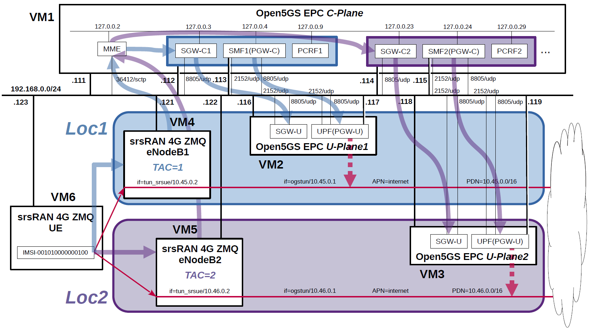

# Open5GS EPC & srsRAN_4G with ZeroMQ UE / RAN Sample Configuration - Select nearby UPF(PGW-U) according to the connected eNodeB
On 2023.05.05, Open5GS MME has a function to select SMF(PGW-C) by TAC and e_CellID.
Therefore I describe a very simple configuration that uses Open5GS and srsRAN_4G to select a nearby UPF(PGW-U) according to the connected eNodeB.

---

### [Sample Configurations and Miscellaneous for Mobile Network](https://github.com/s5uishida/sample_config_misc_for_mobile_network)

---

<a id="toc"></a>

## Table of Contents

- [Overview of Open5GS CUPS-enabled EPC Simulation Mobile Network](#overview)
- [Changes in configuration files of Open5GS EPC and srsRAN_4G ZMQ UE / RAN](#changes)
  - [Changes in configuration files of Open5GS EPC C-Plane](#changes_cp)
  - [Changes in configuration files of Open5GS EPC U-Plane1](#changes_up1)
  - [Changes in configuration files of Open5GS EPC U-Plane2](#changes_up2)
  - [Changes in configuration files of srsRAN_4G ZMQ UE / RAN](#changes_srs)
    - [Changes in configuration files of RAN (eNodeB1)](#changes_ran1)
    - [Changes in configuration files of RAN (eNodeB2)](#changes_ran2)
    - [Changes in configuration files of UE for Loc1 (IMSI-001010000000100)](#changes_ue_loc1)
    - [Changes in configuration files of UE for Loc2 (IMSI-001010000000100)](#changes_ue_loc2)
- [Network settings of Open5GS EPC and srsRAN_4G ZMQ UE / RAN](#network_settings)
  - [Network settings of Open5GS EPC C-Plane](#network_settings_cp)
  - [Network settings of Open5GS EPC U-Plane1](#network_settings_up1)
  - [Network settings of Open5GS EPC U-Plane2](#network_settings_up2)
- [Build Open5GS and srsRAN_4G ZMQ UE / RAN](#build)
- [Run Open5GS EPC and srsRAN_4G ZMQ UE / RAN](#run)
  - [Run Open5GS EPC C-Plane](#run_cp)
  - [Run Open5GS EPC U-Plane1 & U-Plane2](#run_up)
  - [Confirm in Loc1 (TAC=1)](#confirm_loc1)
    - [Run srsRAN_4G ZMQ RAN (eNodeB1) with TAC=1 in Loc1](#run_ran1)
    - [Run srsRAN_4G ZMQ UE (ue-loc1.conf) connected to eNodeB1 in Loc1](#run_ue1)
    - [Ping google.com going through PDN=10.45.0.0/16 on Loc1](#ping_ue1)
  - [Confirm in Loc2 (TAC=2)](#confirm_loc2)
    - [Run srsRAN_4G ZMQ RAN (eNodeB2) with TAC=2 in Loc2](#run_ran2)
    - [Run srsRAN_4G ZMQ UE (ue-loc2.conf) connected to eNodeB2 in Loc2](#run_ue2)
    - [Ping google.com going through PDN=10.46.0.0/16 on Loc2](#ping_ue2)
- [Changelog (summary)](#changelog)

---
<a id="overview"></a>

## Overview of Open5GS CUPS-enabled EPC Simulation Mobile Network

The following minimum configuration was set as a condition.
- The pair of eNodeB and SGW-U/UPF(PGW-U) exists in the same location.
- The UE connected to eNodeB connects to PDN managed by SGW-U/UPF(PGW-U) in the same location.

**In this example, TAC is matched to connect eNodeB and MME, and MME selects SGW-C/SMF(PGW-C) using TAC.**

The built simulation environment is as follows.

</img>

The EPC / UE / RAN used are as follows.
- EPC - Open5GS v2.7.7 (2026.04.23) - https://github.com/open5gs/open5gs
- UE / RAN - srsRAN_4G (2026.01.18) - https://github.com/srsran/srsRAN_4G

Each VMs are as follows.  
| VM# | SW & Role | IP address | OS | Memory (Min) | HDD (Min) |
| --- | --- | --- | --- | --- | --- |
| VM1 | Open5GS EPC C-Plane | 192.168.0.111/24 <br> 192.168.0.112/24 <br> 192.168.0.113/24 <br> 192.168.0.114/24 <br> 192.168.0.115/24 | Ubuntu 24.04 | 2GB | 20GB |
| VM2 | Open5GS EPC U-Plane1 | 192.168.0.116/24 <br> 192.168.0.117/24 | Ubuntu 24.04 | 1GB | 10GB |
| VM3 | Open5GS EPC U-Plane2 | 192.168.0.118/24 <br> 192.168.0.119/24 | Ubuntu 24.04 | 1GB | 10GB |
| VM4 | srsRAN_4G ZMQ RAN (eNodeB1) | 192.168.0.121/24 | Ubuntu 24.04 | 2GB | 10GB |
| VM5 | srsRAN_4G ZMQ RAN (eNodeB2) | 192.168.0.122/24 | Ubuntu 24.04 | 2GB | 10GB |
| VM6 | srsRAN_4G ZMQ UE | 192.168.0.123/24 | Ubuntu 24.04 | 2GB | 10GB |

MME, SGW-C, SMF(PGW-C) and PCRF addresses are as follows. 
| NF | IP address | Local address | Supported TACs |
| --- | --- | --- | --- |
| MME | 192.168.0.111 | 127.0.0.2 | 1, 2 |
| PCRF1 | -- | 127.0.0.9 | -- |
| SGW-C1 | 192.168.0.112 | 127.0.0.3 | 1 |
| SMF1(PGW-C) | 192.168.0.113 | 127.0.0.4 | 1 |
| PCRF2 | -- | 127.0.0.29 | -- |
| SGW-C2 | 192.168.0.114 | 127.0.0.23 | 2 |
| SMF2(PGW-C) | 192.168.0.115 | 127.0.0.24 | 2 |

The main information of eNodeBs is as follows.
| eNodeB# | Location# |IP address | MCC | MNC | TAC | eNodeB ID | Cell ID | E-UTRAN Cell ID |
| --- | --- | --- | --- | --- | --- | --- | --- | --- |
| eNodeB1 | Loc1 | 192.168.0.121 | 001 | 01 | 1 | 0x19b | 0x01 | 0x19b01 |
| eNodeB2 | Loc2 | 192.168.0.122 | 001 | 01 | 2 | 0x19c | 0x01 | 0x19c01 |

Subscriber Information (other information is the same) is as follows.  
| UE | IMSI | APN | OP/OPc | eNodeB# |
| --- | --- | --- | --- | --- |
| UE | 001010000000100 | internet | OPc | eNodeB1 in Loc1 <br> eNodeB2 in Loc2 |

I registered these information with the Open5GS WebUI.
In addition, [3GPP TS 35.208](https://www.3gpp.org/DynaReport/35208.htm) "4.3 Test Sets" is published by 3GPP as test data for the 3GPP authentication and key generation functions (MILENAGE).

Each PDNs are as follows.
| PDN | Location# |  TUNnel interface of PDN | APN | TUNnel interface of UE | U-Plane# |
| --- | --- | --- | --- | --- | --- |
| 10.45.0.0/16 | Loc1 | ogstun | internet | tun_srsue | U-Plane1 |
| 10.46.0.0/16 | Loc2 | ogstun | internet | tun_srsue | U-Plane2 |

<a id="changes"></a>

## Changes in configuration files of Open5GS EPC and srsRAN_4G ZMQ UE / RAN

Please refer to the following for building Open5GS and srsRAN_4G ZMQ UE / RAN respectively.
- Open5GS v2.7.7 (2026.04.23) - https://open5gs.org/open5gs/docs/guide/02-building-open5gs-from-sources/
- srsRAN_4G (2026.01.18) - https://github.com/s5uishida/build_srsran_4g_zmq_disable_rf_plugins

<a id="changes_cp"></a>

### Changes in configuration files of Open5GS EPC C-Plane

- `open5gs/install/etc/open5gs/mme.yaml`
```diff
--- mme.yaml.orig       2026-05-06 09:05:03.000000000 +0900
+++ mme.yaml    2026-05-06 16:51:24.719466279 +0900
@@ -12,30 +12,36 @@
   freeDiameter: /root/open5gs/install/etc/freeDiameter/mme.conf
   s1ap:
     server:
-      - address: 127.0.0.2
+      - address: 192.168.0.111
   gtpc:
     server:
       - address: 127.0.0.2
     client:
       sgwc:
         - address: 127.0.0.3
+          tac: 1
+        - address: 127.0.0.23
+          tac: 2
       smf:
         - address: 127.0.0.4
+          tac: 1
+        - address: 127.0.0.24
+          tac: 2
   metrics:
     server:
       - address: 127.0.0.2
         port: 9090
   gummei:
     - plmn_id:
-        mcc: 999
-        mnc: 70
+        mcc: 001
+        mnc: 01
       mme_gid: 2
       mme_code: 1
   tai:
     - plmn_id:
-        mcc: 999
-        mnc: 70
-      tac: 1
+        mcc: 001
+        mnc: 01
+      tac: [1, 2]
   security:
     integrity_order : [ EIA2, EIA1, EIA0 ]
     ciphering_order : [ EEA0, EEA1, EEA2 ]
```
- `open5gs/install/etc/open5gs/pcrf1.yaml`
```diff
--- pcrf.yaml.orig      2026-05-06 09:05:04.000000000 +0900
+++ pcrf1.yaml  2026-05-06 16:53:14.375494249 +0900
@@ -1,7 +1,7 @@
 db_uri: mongodb://localhost/open5gs
 logger:
   file:
-    path: /root/open5gs/install/var/log/open5gs/pcrf.log
+    path: /root/open5gs/install/var/log/open5gs/pcrf1.log
 #  level: info   # fatal|error|warn|info(default)|debug|trace
 
 global:
@@ -9,7 +9,7 @@
     ue: 1024  # The number of UE can be increased depending on memory size.
 #    peer: 64
 pcrf:
-  freeDiameter: /root/open5gs/install/etc/freeDiameter/pcrf.conf
+  freeDiameter: /root/open5gs/install/etc/freeDiameter/pcrf1.conf
   metrics:
     server:
       - address: 127.0.0.9
```
- `open5gs/install/etc/open5gs/pcrf2.yaml`
```diff
--- pcrf.yaml.orig      2026-05-06 09:05:04.000000000 +0900
+++ pcrf2.yaml  2026-05-06 16:56:07.818446480 +0900
@@ -1,7 +1,7 @@
 db_uri: mongodb://localhost/open5gs
 logger:
   file:
-    path: /root/open5gs/install/var/log/open5gs/pcrf.log
+    path: /root/open5gs/install/var/log/open5gs/pcrf2.log
 #  level: info   # fatal|error|warn|info(default)|debug|trace
 
 global:
@@ -9,10 +9,10 @@
     ue: 1024  # The number of UE can be increased depending on memory size.
 #    peer: 64
 pcrf:
-  freeDiameter: /root/open5gs/install/etc/freeDiameter/pcrf.conf
+  freeDiameter: /root/open5gs/install/etc/freeDiameter/pcrf2.conf
   metrics:
     server:
-      - address: 127.0.0.9
+      - address: 127.0.0.29
         port: 9090
 
 ################################################################################
```
- `open5gs/install/etc/open5gs/sgwc1.yaml`
```diff
--- sgwc.yaml.orig      2026-05-06 09:05:03.000000000 +0900
+++ sgwc1.yaml  2026-05-06 17:02:24.420659631 +0900
@@ -1,6 +1,6 @@
 logger:
   file:
-    path: /root/open5gs/install/var/log/open5gs/sgwc.log
+    path: /root/open5gs/install/var/log/open5gs/sgwc1.log
 #  level: info   # fatal|error|warn|info(default)|debug|trace
 
 global:
@@ -14,10 +14,11 @@
       - address: 127.0.0.3
   pfcp:
     server:
-      - address: 127.0.0.3
+      - address: 192.168.0.112
     client:
       sgwu:
-        - address: 127.0.0.6
+        - address: 192.168.0.116
+          apn: internet
 
 ################################################################################
 # GTP-C Server
```
- `open5gs/install/etc/open5gs/sgwc2.yaml`
```diff
--- sgwc.yaml.orig      2026-05-06 09:05:03.000000000 +0900
+++ sgwc2.yaml  2026-05-06 17:03:44.794697265 +0900
@@ -1,6 +1,6 @@
 logger:
   file:
-    path: /root/open5gs/install/var/log/open5gs/sgwc.log
+    path: /root/open5gs/install/var/log/open5gs/sgwc2.log
 #  level: info   # fatal|error|warn|info(default)|debug|trace
 
 global:
@@ -11,13 +11,14 @@
 sgwc:
   gtpc:
     server:
-      - address: 127.0.0.3
+      - address: 127.0.0.23
   pfcp:
     server:
-      - address: 127.0.0.3
+      - address: 192.168.0.114
     client:
       sgwu:
-        - address: 127.0.0.6
+        - address: 192.168.0.118
+          apn: internet
 
 ################################################################################
 # GTP-C Server
```
- `open5gs/install/etc/open5gs/smf1.yaml`
```diff
--- smf.yaml.orig       2026-05-06 09:05:03.000000000 +0900
+++ smf1.yaml   2026-05-06 17:07:28.695534748 +0900
@@ -1,6 +1,6 @@
 logger:
   file:
-    path: /root/open5gs/install/var/log/open5gs/smf.log
+    path: /root/open5gs/install/var/log/open5gs/smf1.log
 #  level: info   # fatal|error|warn|info(default)|debug|trace
 
 global:
@@ -9,27 +9,19 @@
 #    peer: 64
 
 smf:
-  sbi:
-    server:
-      - address: 127.0.0.4
-        port: 7777
-    client:
-#      nrf:
-#        - uri: http://127.0.0.10:7777
-      scp:
-        - uri: http://127.0.0.200:7777
   pfcp:
     server:
-      - address: 127.0.0.4
+      - address: 192.168.0.113
     client:
       upf:
-        - address: 127.0.0.7
+        - address: 192.168.0.117
+          dnn: internet
   gtpc:
     server:
       - address: 127.0.0.4
   gtpu:
     server:
-      - address: 127.0.0.4
+      - address: 192.168.0.113
   metrics:
     server:
       - address: 127.0.0.4
@@ -37,20 +29,17 @@
   session:
     - subnet: 10.45.0.0/16
       gateway: 10.45.0.1
-    - subnet: 2001:db8:cafe::/48
-      gateway: 2001:db8:cafe::1
+      dnn: internet
   dns:
     - 8.8.8.8
     - 8.8.4.4
-    - 2001:4860:4860::8888
-    - 2001:4860:4860::8844
   mtu: 1400
 #  p-cscf:
 #    - 127.0.0.1
 #    - ::1
 #  ctf:
 #    enabled: auto   # auto(default)|yes|no
-  freeDiameter: /root/open5gs/install/etc/freeDiameter/smf.conf
+  freeDiameter: /root/open5gs/install/etc/freeDiameter/smf1.conf
 
 ################################################################################
 # SMF Info
```
- `open5gs/install/etc/open5gs/smf2.yaml`
```diff
--- smf.yaml.orig       2026-05-06 09:05:03.000000000 +0900
+++ smf2.yaml   2026-05-06 17:11:20.747597613 +0900
@@ -1,6 +1,6 @@
 logger:
   file:
-    path: /root/open5gs/install/var/log/open5gs/smf.log
+    path: /root/open5gs/install/var/log/open5gs/smf2.log
 #  level: info   # fatal|error|warn|info(default)|debug|trace
 
 global:
@@ -9,48 +9,37 @@
 #    peer: 64
 
 smf:
-  sbi:
-    server:
-      - address: 127.0.0.4
-        port: 7777
-    client:
-#      nrf:
-#        - uri: http://127.0.0.10:7777
-      scp:
-        - uri: http://127.0.0.200:7777
   pfcp:
     server:
-      - address: 127.0.0.4
+      - address: 192.168.0.115
     client:
       upf:
-        - address: 127.0.0.7
+        - address: 192.168.0.119
+          dnn: internet
   gtpc:
     server:
-      - address: 127.0.0.4
+      - address: 127.0.0.24
   gtpu:
     server:
-      - address: 127.0.0.4
+      - address: 192.168.0.115
   metrics:
     server:
-      - address: 127.0.0.4
+      - address: 127.0.0.24
         port: 9090
   session:
-    - subnet: 10.45.0.0/16
-      gateway: 10.45.0.1
-    - subnet: 2001:db8:cafe::/48
-      gateway: 2001:db8:cafe::1
+    - subnet: 10.46.0.0/16
+      gateway: 10.46.0.1
+      dnn: internet
   dns:
     - 8.8.8.8
     - 8.8.4.4
-    - 2001:4860:4860::8888
-    - 2001:4860:4860::8844
   mtu: 1400
 #  p-cscf:
 #    - 127.0.0.1
 #    - ::1
 #  ctf:
 #    enabled: auto   # auto(default)|yes|no
-  freeDiameter: /root/open5gs/install/etc/freeDiameter/smf.conf
+  freeDiameter: /root/open5gs/install/etc/freeDiameter/smf2.conf
 
 ################################################################################
 # SMF Info
```
- `open5gs/install/etc/freeDiameter/pcrf1.conf`  
`pcrf1.conf` is equal to the original `pcrf.conf`.

- `open5gs/install/etc/freeDiameter/pcrf2.conf`
```diff
--- pcrf.conf.orig      2023-04-30 00:53:22.000000000 +0900
+++ pcrf2.conf  2023-05-07 18:32:04.246141671 +0900
@@ -79,7 +79,7 @@
 #ListenOn = "202.249.37.5";
 #ListenOn = "2001:200:903:2::202:1";
 #ListenOn = "fe80::21c:5ff:fe98:7d62%eth0";
-ListenOn = "127.0.0.9";
+ListenOn = "127.0.0.29";
 
 
 ##############################################################
@@ -261,6 +261,6 @@
 # Examples:
 #ConnectPeer = "aaa.wide.ad.jp";
 #ConnectPeer = "old.diameter.serv" { TcTimer = 60; TLS_old_method; No_SCTP; Port=3868; } ;
-ConnectPeer = "smf.localdomain" { ConnectTo = "127.0.0.4"; No_TLS; };
+ConnectPeer = "smf.localdomain" { ConnectTo = "127.0.0.24"; No_TLS; };
```
- `open5gs/install/etc/freeDiameter/smf1.conf`  
`smf1.conf` is equal to the original `smf.conf`.

- `open5gs/install/etc/freeDiameter/smf2.conf`
```diff
--- smf.conf.orig       2023-04-30 00:53:22.000000000 +0900
+++ smf2.conf   2023-05-03 11:20:46.000000000 +0900
@@ -79,7 +79,7 @@
 #ListenOn = "202.249.37.5";
 #ListenOn = "2001:200:903:2::202:1";
 #ListenOn = "fe80::21c:5ff:fe98:7d62%eth0";
-ListenOn = "127.0.0.4";
+ListenOn = "127.0.0.24";
 
 
 ##############################################################
@@ -261,7 +261,7 @@
 # Examples:
 #ConnectPeer = "aaa.wide.ad.jp";
 #ConnectPeer = "old.diameter.serv" { TcTimer = 60; TLS_old_method; No_SCTP; Port=3868; } ;
-ConnectPeer = "pcrf.localdomain" { ConnectTo = "127.0.0.9"; No_TLS; };
+ConnectPeer = "pcrf.localdomain" { ConnectTo = "127.0.0.29"; No_TLS; };
 
 
 ##############################################################
```

<a id="changes_up1"></a>

### Changes in configuration files of Open5GS EPC U-Plane1

- `open5gs/install/etc/open5gs/sgwu.yaml`
```diff
--- sgwu.yaml.orig      2025-11-20 05:59:10.000000000 +0900
+++ sgwu.yaml   2026-05-06 17:27:23.036517986 +0900
@@ -11,13 +11,13 @@
 sgwu:
   pfcp:
     server:
-      - address: 127.0.0.6
+      - address: 192.168.0.116
     client:
 #      sgwc:    # SGW-U PFCP Client try to associate SGW-C PFCP Server
 #        - address: 127.0.0.3
   gtpu:
     server:
-      - address: 127.0.0.6
+      - address: 192.168.0.116
 
 ################################################################################
 # PFCP Server
```
- `open5gs/install/etc/open5gs/upf.yaml`
```diff
--- upf.yaml.orig       2024-05-02 19:52:00.000000000 +0900
+++ upf.yaml    2026-05-06 17:29:39.418135024 +0900
@@ -11,18 +11,18 @@
 upf:
   pfcp:
     server:
-      - address: 127.0.0.7
+      - address: 192.168.0.117
     client:
 #      smf:     #  UPF PFCP Client try to associate SMF PFCP Server
 #        - address: 127.0.0.4
   gtpu:
     server:
-      - address: 127.0.0.7
+      - address: 192.168.0.117
   session:
     - subnet: 10.45.0.0/16
       gateway: 10.45.0.1
-    - subnet: 2001:db8:cafe::/48
-      gateway: 2001:db8:cafe::1
+      dnn: internet
+      dev: ogstun
   metrics:
     server:
       - address: 127.0.0.7
```

<a id="changes_up2"></a>

### Changes in configuration files of Open5GS EPC U-Plane2

- `open5gs/install/etc/open5gs/sgwu.yaml`
```diff
--- sgwu.yaml.orig      2025-11-20 05:59:10.000000000 +0900
+++ sgwu.yaml   2026-05-06 17:33:08.417349531 +0900
@@ -11,13 +11,13 @@
 sgwu:
   pfcp:
     server:
-      - address: 127.0.0.6
+      - address: 192.168.0.118
     client:
 #      sgwc:    # SGW-U PFCP Client try to associate SGW-C PFCP Server
 #        - address: 127.0.0.3
   gtpu:
     server:
-      - address: 127.0.0.6
+      - address: 192.168.0.118
 
 ################################################################################
 # PFCP Server
```
- `open5gs/install/etc/open5gs/upf.yaml`
```diff
--- upf.yaml.orig       2024-05-02 19:52:00.000000000 +0900
+++ upf.yaml    2026-05-06 17:33:34.289487785 +0900
@@ -11,18 +11,18 @@
 upf:
   pfcp:
     server:
-      - address: 127.0.0.7
+      - address: 192.168.0.119
     client:
 #      smf:     #  UPF PFCP Client try to associate SMF PFCP Server
 #        - address: 127.0.0.4
   gtpu:
     server:
-      - address: 127.0.0.7
+      - address: 192.168.0.119
   session:
-    - subnet: 10.45.0.0/16
-      gateway: 10.45.0.1
-    - subnet: 2001:db8:cafe::/48
-      gateway: 2001:db8:cafe::1
+    - subnet: 10.46.0.0/16
+      gateway: 10.46.0.1
+      dnn: internet
+      dev: ogstun
   metrics:
     server:
       - address: 127.0.0.7
```

<a id="changes_srs"></a>

### Changes in configuration files of srsRAN_4G ZMQ UE / RAN

<a id="changes_ran1"></a>

#### Changes in configuration files of RAN (eNodeB1)

- `srsRAN_4G/build/srsenb/enb.conf`
```diff
--- enb.conf.example    2026-01-26 19:35:53.000000000 +0900
+++ enb.conf    2026-05-06 19:58:37.636770628 +0900
@@ -22,9 +22,9 @@
 enb_id = 0x19B
 mcc = 001
 mnc = 01
-mme_addr = 127.0.1.100
-gtp_bind_addr = 127.0.1.1
-s1c_bind_addr = 127.0.1.1
+mme_addr = 192.168.0.111
+gtp_bind_addr = 192.168.0.121
+s1c_bind_addr = 192.168.0.121
 s1c_bind_port = 0
 n_prb = 50
 #tm = 4
@@ -80,8 +80,8 @@
 #time_adv_nsamples = auto
 
 # Example for ZMQ-based operation with TCP transport for I/Q samples
-#device_name = zmq
-#device_args = fail_on_disconnect=true,tx_port=tcp://*:2000,rx_port=tcp://localhost:2001,id=enb,base_srate=23.04e6
+device_name = zmq
+device_args = fail_on_disconnect=true,tx_port=tcp://192.168.0.121:2000,rx_port=tcp://192.168.0.123:2001,id=enb,base_srate=23.04e6
 
 #####################################################################
 # Packet capture configuration
```
- `srsRAN_4G/build/srsenb/rr.conf`
```diff
--- rr.conf.example     2024-02-03 23:26:02.000000000 +0900
+++ rr.conf     2023-05-02 11:52:54.000000000 +0900
@@ -55,7 +55,7 @@
   {
     // rf_port = 0;
     cell_id = 0x01;
-    tac = 0x0007;
+    tac = 0x0001;
     pci = 1;
     // root_seq_idx = 204;
     dl_earfcn = 3350;
```

<a id="changes_ran2"></a>

#### Changes in configuration files of RAN (eNodeB2)

- `srsRAN_4G/build/srsenb/enb.conf`
```diff
--- enb.conf.example    2026-01-26 19:35:53.000000000 +0900
+++ enb.conf    2026-05-06 20:31:50.689395895 +0900
@@ -19,12 +19,12 @@
 #
 #####################################################################
 [enb]
-enb_id = 0x19B
+enb_id = 0x19C
 mcc = 001
 mnc = 01
-mme_addr = 127.0.1.100
-gtp_bind_addr = 127.0.1.1
-s1c_bind_addr = 127.0.1.1
+mme_addr = 192.168.0.111
+gtp_bind_addr = 192.168.0.122
+s1c_bind_addr = 192.168.0.122
 s1c_bind_port = 0
 n_prb = 50
 #tm = 4
@@ -80,8 +80,8 @@
 #time_adv_nsamples = auto
 
 # Example for ZMQ-based operation with TCP transport for I/Q samples
-#device_name = zmq
-#device_args = fail_on_disconnect=true,tx_port=tcp://*:2000,rx_port=tcp://localhost:2001,id=enb,base_srate=23.04e6
+device_name = zmq
+device_args = fail_on_disconnect=true,tx_port=tcp://192.168.0.122:2000,rx_port=tcp://192.168.0.123:2101,id=enb,base_srate=23.04e6
 
 #####################################################################
 # Packet capture configuration
```
- `srsRAN_4G/build/srsenb/rr.conf`
```diff
--- rr.conf.example     2024-02-03 23:26:02.000000000 +0900
+++ rr.conf     2024-03-26 22:05:16.860031943 +0900
@@ -55,7 +55,7 @@
   {
     // rf_port = 0;
     cell_id = 0x01;
-    tac = 0x0007;
+    tac = 0x0002;
     pci = 1;
     // root_seq_idx = 204;
     dl_earfcn = 3350;
```

<a id="changes_ue_loc1"></a>

#### Changes in configuration files of UE for Loc1 (IMSI-001010000000100)

- `srsRAN_4G/build/srsue/ue-loc1.conf`
```diff
--- ue.conf.example     2024-02-03 23:26:02.000000000 +0900
+++ ue-loc1.conf        2024-03-26 22:07:25.360060344 +0900
@@ -42,8 +42,8 @@
 #continuous_tx     = auto
 
 # Example for ZMQ-based operation with TCP transport for I/Q samples
-#device_name = zmq
-#device_args = tx_port=tcp://*:2001,rx_port=tcp://localhost:2000,id=ue,base_srate=23.04e6
+device_name = zmq
+device_args = tx_port=tcp://192.168.0.123:2001,rx_port=tcp://192.168.0.121:2000,id=ue,base_srate=23.04e6
 
 #####################################################################
 # EUTRA RAT configuration
@@ -139,9 +139,9 @@
 [usim]
 mode = soft
 algo = milenage
-opc  = 63BFA50EE6523365FF14C1F45F88737D
-k    = 00112233445566778899aabbccddeeff
-imsi = 001010123456780
+opc  = E8ED289DEBA952E4283B54E88E6183CA
+k    = 465B5CE8B199B49FAA5F0A2EE238A6BC
+imsi = 001010000000100
 imei = 353490069873319
 #reader =
 #pin  = 1234
@@ -180,8 +180,8 @@
 #                      Supported: 0 - NULL, 1 - Snow3G, 2 - AES, 3 - ZUC
 #####################################################################
 [nas]
-#apn = internetinternet
-#apn_protocol = ipv4
+apn = internet
+apn_protocol = ipv4
 #user = srsuser
 #pass = srspass
 #force_imsi_attach = false
```

<a id="changes_ue_loc2"></a>

#### Changes in configuration files of UE for Loc2 (IMSI-001010000000100)

- `srsRAN_4G/build/srsue/ue-loc2.conf`
```diff
--- ue.conf.example     2024-02-03 23:26:02.000000000 +0900
+++ ue-loc2.conf        2026-05-06 20:32:08.151605396 +0900
@@ -42,8 +42,8 @@
 #continuous_tx     = auto
 
 # Example for ZMQ-based operation with TCP transport for I/Q samples
-#device_name = zmq
-#device_args = tx_port=tcp://*:2001,rx_port=tcp://localhost:2000,id=ue,base_srate=23.04e6
+device_name = zmq
+device_args = tx_port=tcp://192.168.0.123:2101,rx_port=tcp://192.168.0.122:2000,id=ue,base_srate=23.04e6
 
 #####################################################################
 # EUTRA RAT configuration
@@ -139,9 +139,9 @@
 [usim]
 mode = soft
 algo = milenage
-opc  = 63BFA50EE6523365FF14C1F45F88737D
-k    = 00112233445566778899aabbccddeeff
-imsi = 001010123456780
+opc  = E8ED289DEBA952E4283B54E88E6183CA
+k    = 465B5CE8B199B49FAA5F0A2EE238A6BC
+imsi = 001010000000100
 imei = 353490069873319
 #reader =
 #pin  = 1234
@@ -180,8 +180,8 @@
 #                      Supported: 0 - NULL, 1 - Snow3G, 2 - AES, 3 - ZUC
 #####################################################################
 [nas]
-#apn = internetinternet
-#apn_protocol = ipv4
+apn = internet
+apn_protocol = ipv4
 #user = srsuser
 #pass = srspass
 #force_imsi_attach = false
```

<a id="network_settings"></a>

## Network settings of Open5GS EPC and srsRAN_4G ZMQ UE / RAN

<a id="network_settings_cp"></a>

### Network settings of Open5GS EPC C-Plane

Add IP addresses for SGW-C1/SMF1(PGW-C) and SGW-C2/SMF2(PGW-C).
```
ip addr add 192.168.0.112/24 dev ens19
ip addr add 192.168.0.113/24 dev ens19
ip addr add 192.168.0.114/24 dev ens19
ip addr add 192.168.0.115/24 dev ens19
```
**Note. `ens19` is the network interface of `192.168.0.0/24` in my Proxmox VE environment.
Please change it according to your environment.**

<a id="network_settings_up1"></a>

### Network settings of Open5GS EPC U-Plane1

First, uncomment the next line in the `/etc/sysctl.conf` file and reflect it in the OS.
```
net.ipv4.ip_forward=1
```
```
# sysctl -p
```
Next, add IP address for UPF(PGW-U) and configure the TUNnel interface and NAPT.
```
ip addr add 192.168.0.117/24 dev ens19

ip tuntap add name ogstun mode tun
ip addr add 10.45.0.1/16 dev ogstun
ip link set ogstun up

iptables -t nat -A POSTROUTING -s 10.45.0.0/16 ! -o ogstun -j MASQUERADE
```

<a id="network_settings_up2"></a>

### Network settings of Open5GS EPC U-Plane2

First, uncomment the next line in the `/etc/sysctl.conf` file and reflect it in the OS.
```
net.ipv4.ip_forward=1
```
```
# sysctl -p
```
Next, add IP address for UPF(PGW-U) and configure the TUNnel interface and NAPT.
```
ip addr add 192.168.0.119/24 dev ens19

ip tuntap add name ogstun mode tun
ip addr add 10.46.0.1/16 dev ogstun
ip link set ogstun up

iptables -t nat -A POSTROUTING -s 10.46.0.0/16 ! -o ogstun -j MASQUERADE
```

<a id="build"></a>

## Build Open5GS and srsRAN_4G ZMQ UE / RAN

Please refer to the following for building Open5GS and srsRAN_4G ZMQ UE / RAN respectively.
- Open5GS v2.7.7 (2026.04.23) - https://open5gs.org/open5gs/docs/guide/02-building-open5gs-from-sources/
- srsRAN_4G (2026.01.18) - https://github.com/s5uishida/build_srsran_4g_zmq_disable_rf_plugins

Install MongoDB on Open5GS EPC C-Plane machine.
It is not necessary to install MongoDB on Open5GS EPC U-Plane machines.
[MongoDB Compass](https://www.mongodb.com/products/compass) is a convenient tool to look at the MongoDB database.

<a id="run"></a>

## Run Open5GS EPC and srsRAN_4G ZMQ UE / RAN

I will confirm in the following scenario.
The reasons to confirm in such a scenario are as follows:

**[The reason for Open5GS](https://github.com/open5gs/open5gs/issues/1791)**
- In the current Open5GS, SGW changes occurs only at TAU/Handover.

**[The reason for srsRAN_4G with ZMQ](https://docs.srsran.com/projects/4g/en/latest/app_notes/source/zeromq/source/index.html#known-issues)**
- For a clean tear down, the UE needs to be terminated first, then the eNB.
- eNB and UE can only run once.
- Currently a single eNB and a single UE are only supported.

**This scenario:**
```
1) EPC start

     C-Plane start
               |
               V
    U-Plane1 start
               |
               V
    U-Plane2 start

2) eNodeB1/UE(Loc1) start, ping and eNodeB1/UE(Loc1) stop

     eNodeB1 start
               |
               V
    UE(Loc1) start
               |
               V
             ping google.com -I tun_srsue -n
               |
               V
    UE(Loc1) stop
               |
               V
     eNodeB1 stop

3) eNodeB2/UE(Loc2) start, ping and eNodeB2/UE(Loc2) stop

     eNodeB2 start
               |
               V
    UE(Loc2) start
               |
               V
             ping google.com -I tun_srsue -n
               |
               V
    UE(Loc2) stop
               |
               V
     eNodeB2 stop
```
**Note. This scenario is just for confirming the function.**

<a id="run_cp"></a>

### Run Open5GS EPC C-Plane

First, run Open5GS EPC C-Plane.

- Open5GS EPC C-Plane
```
./install/bin/open5gs-hssd &
./install/bin/open5gs-pcrfd -c install/etc/open5gs/pcrf1.yaml &
./install/bin/open5gs-pcrfd -c install/etc/open5gs/pcrf2.yaml &
sleep 1
./install/bin/open5gs-mmed &
./install/bin/open5gs-sgwcd -c install/etc/open5gs/sgwc1.yaml &
./install/bin/open5gs-sgwcd -c install/etc/open5gs/sgwc2.yaml &
./install/bin/open5gs-smfd -c install/etc/open5gs/smf1.yaml &
./install/bin/open5gs-smfd -c install/etc/open5gs/smf2.yaml &
```

<a id="run_up"></a>

### Run Open5GS EPC U-Plane1 & U-Plane2

Next, run Open5GS EPC U-Planes.

- Open5GS EPC U-Plane1
```
./install/bin/open5gs-sgwud &
./install/bin/open5gs-upfd &
```
- Open5GS EPC U-Plane2
```
./install/bin/open5gs-sgwud &
./install/bin/open5gs-upfd &
```
Then run `tcpdump` on one more terminal for each U-Plane.
- Run `tcpdump` on VM2 (U-Plane1)
```
# tcpdump -i ogstun -n
tcpdump: verbose output suppressed, use -v[v]... for full protocol decode
listening on ogstun, link-type RAW (Raw IP), snapshot length 262144 bytes
```
- Run `tcpdump` on VM3 (U-Plane2)
```
# tcpdump -i ogstun -n
tcpdump: verbose output suppressed, use -v[v]... for full protocol decode
listening on ogstun, link-type RAW (Raw IP), snapshot length 262144 bytes
```

<a id="confirm_loc1"></a>

### Confirm in Loc1 (TAC=1)

<a id="run_ran1"></a>

#### Run srsRAN_4G ZMQ RAN (eNodeB1) with TAC=1 in Loc1

Run srsRAN_4G ZMQ RAN (eNodeB1) and connect to Open5GS EPC.
```
# cd srsRAN_4G/build/srsenb
# ./src/srsenb enb.conf
---  Software Radio Systems LTE eNodeB  ---

Reading configuration file enb.conf...

Built in Release mode using commit 6bcbd9e5b on branch master.

Opening 1 channels in RF device=zmq with args=fail_on_disconnect=true,tx_port=tcp://192.168.0.121:2000,rx_port=tcp://192.168.0.123:2001,id=enb,base_srate=23.04e6
Supported RF device list: zmq file
CHx base_srate=23.04e6
CHx id=enb
Current sample rate is 1.92 MHz with a base rate of 23.04 MHz (x12 decimation)
CH0 rx_port=tcp://192.168.0.123:2001
CH0 tx_port=tcp://192.168.0.121:2000
CH0 fail_on_disconnect=true
Current sample rate is 11.52 MHz with a base rate of 23.04 MHz (x2 decimation)
Current sample rate is 11.52 MHz with a base rate of 23.04 MHz (x2 decimation)
Setting frequency: DL=2680.0 Mhz, UL=2560.0 MHz for cc_idx=0 nof_prb=50

==== eNodeB started ===
Type <t> to view trace
```
The Open5GS C-Plane log when executed is as follows.
```
05/06 21:47:28.088: [mme] INFO: eNB-S1 accepted[192.168.0.121]:46893 in s1_path module (../src/mme/s1ap-sctp.c:114)
05/06 21:47:28.088: [mme] INFO: eNB-S1 accepted[192.168.0.121] in master_sm module (../src/mme/mme-sm.c:108)
05/06 21:47:28.088: [mme] INFO: [Added] Number of eNBs is now 1 (../src/mme/mme-context.c:3131)
05/06 21:47:28.088: [mme] INFO: eNB-S1[192.168.0.121] max_num_of_ostreams : 30 (../src/mme/mme-sm.c:157)
```

<a id="run_ue1"></a>

#### Run srsRAN_4G ZMQ UE (ue-loc1.conf) connected to eNodeB1 in Loc1

Run srsRAN_4G ZMQ UE (ue-loc1.conf), connect to eNodeB1 in Loc1 and connect to Open5GS EPC.
```
# cd srsRAN_4G/build/srsue
# ./src/srsue ue-loc1.conf
Reading configuration file ue-loc1.conf...

Built in Release mode using commit 6bcbd9e5b on branch master.

Opening 1 channels in RF device=zmq with args=tx_port=tcp://192.168.0.123:2001,rx_port=tcp://192.168.0.121:2000,id=ue,base_srate=23.04e6
Supported RF device list: zmq file
CHx base_srate=23.04e6
CHx id=ue
Current sample rate is 1.92 MHz with a base rate of 23.04 MHz (x12 decimation)
CH0 rx_port=tcp://192.168.0.121:2000
CH0 tx_port=tcp://192.168.0.123:2001
Waiting PHY to initialize ... done!
Attaching UE...
Current sample rate is 1.92 MHz with a base rate of 23.04 MHz (x12 decimation)
Current sample rate is 1.92 MHz with a base rate of 23.04 MHz (x12 decimation)
.
Found Cell:  Mode=FDD, PCI=1, PRB=50, Ports=1, CP=Normal, CFO=-0.2 KHz
Current sample rate is 11.52 MHz with a base rate of 23.04 MHz (x2 decimation)
Current sample rate is 11.52 MHz with a base rate of 23.04 MHz (x2 decimation)
Found PLMN:  Id=00101, TAC=1
Random Access Transmission: seq=27, tti=341, ra-rnti=0x2
RRC Connected
Random Access Complete.     c-rnti=0x46, ta=0
Network attach successful. IP: 10.45.0.2
 nTp) ((t) 6/5/2026 12:48:39 TZ:99
```
The Open5GS C-Plane log when executed is as follows.
```
05/06 21:48:39.475: [mme] INFO: InitialUEMessage (../src/mme/s1ap-handler.c:493)
05/06 21:48:39.475: [mme] INFO: [Added] Number of eNB-UEs is now 1 (../src/mme/mme-context.c:5315)
05/06 21:48:39.475: [mme] INFO: Unknown UE by S_TMSI[G:2,C:1,M_TMSI:0xc0000278] (../src/mme/s1ap-handler.c:594)
05/06 21:48:39.475: [mme] INFO:     ENB_UE_S1AP_ID[1] MME_UE_S1AP_ID[1] TAC[1] CellID[0x19b01] (../src/mme/s1ap-handler.c:734)
05/06 21:48:39.475: [mme] INFO: Unknown UE by GUTI[G:2,C:1,M_TMSI:0xc0000278] (../src/mme/mme-context.c:3941)
05/06 21:48:39.475: [mme] INFO: [Added] Number of MME-UEs is now 1 (../src/mme/mme-context.c:3734)
05/06 21:48:39.475: [emm] INFO: [] Attach request (../src/mme/emm-sm.c:488)
05/06 21:48:39.475: [emm] INFO:     GUTI[G:2,C:1,M_TMSI:0xc0000278] IMSI[Unknown IMSI] (../src/mme/emm-handler.c:256)
05/06 21:48:39.497: [emm] INFO: Identity response (../src/mme/emm-sm.c:458)
05/06 21:48:39.497: [emm] INFO:     IMSI[001010000000100] (../src/mme/emm-handler.c:492)
05/06 21:48:39.565: [mme] INFO: Bearer added (EBI=5 IMSI=001010000000100) (../src/mme/mme-context.c:4597)
05/06 21:48:39.565: [mme] INFO: [Added] Number of MME-Sessions is now 1 (../src/mme/mme-context.c:5329)
05/06 21:48:39.605: [sgwc] INFO: [Added] Number of SGWC-UEs is now 1 (../src/sgwc/context.c:246)
05/06 21:48:39.605: [sgwc] INFO: Create Session Request (../src/sgwc/s11-handler.c:191)
05/06 21:48:39.605: [sgwc] INFO: [Added] Number of SGWC-Sessions is now 1 (../src/sgwc/context.c:959)
05/06 21:48:39.605: [sgwc] INFO: UE IMSI[001010000000100] APN[internet] (../src/sgwc/s11-handler.c:260)
05/06 21:48:39.605: [sgwc] INFO:     TAI[PLMN_ID:00f110,TAC:1] (../src/sgwc/s11-handler.c:273)
05/06 21:48:39.605: [sgwc] INFO:     E_CGI[PLMN_ID:00f110,CELL_ID:0x19b01] (../src/sgwc/s11-handler.c:276)
05/06 21:48:39.605: [sgwc] INFO:     MME_S11_TEID[704] SGW_S11_TEID[541] (../src/sgwc/s11-handler.c:429)
05/06 21:48:39.605: [sgwc] INFO: Session Establishment Request (../src/sgwc/sxa-build.c:39)
05/06 21:48:39.606: [sgwc] INFO: Session Establishment Response (../src/sgwc/sxa-handler.c:173)
05/06 21:48:39.606: [sgwc] INFO:     SGW_S5C_TEID[0xac8] PGW_S5C_TEID[0x0] (../src/sgwc/sxa-handler.c:271)
05/06 21:48:39.606: [sgwc] INFO:     SGW_S5U_TEID[44094] PGW_S5U_TEID[0] (../src/sgwc/sxa-handler.c:282)
05/06 21:48:39.606: [gtp] INFO: gtp_connect() [127.0.0.4]:2123 (../lib/gtp/path.c:60)
05/06 21:48:39.606: [smf] INFO: [Added] Number of SMF-UEs is now 1 (../src/smf/context.c:1069)
05/06 21:48:39.606: [smf] INFO: [Added] Number of SMF-Sessions is now 1 (../src/smf/context.c:3393)
05/06 21:48:39.606: [smf] INFO: UE IMSI[001010000000100] APN[internet] IPv4[10.45.0.2] IPv6[] (../src/smf/s5c-handler.c:312)
05/06 21:48:39.610: [gtp] INFO: gtp_connect() [192.168.0.117]:2152 (../lib/gtp/path.c:60)
05/06 21:48:39.610: [sgwc] INFO: Create Session Response (../src/sgwc/s5c-handler.c:95)
05/06 21:48:39.610: [sgwc] INFO:     MME_S11_TEID[704] SGW_S11_TEID[541] (../src/sgwc/s5c-handler.c:230)
05/06 21:48:39.610: [sgwc] INFO:     SGW_S5C_TEID[0xac8] PGW_S5C_TEID[0x0] (../src/sgwc/s5c-handler.c:232)
05/06 21:48:39.610: [sgwc] INFO:     SGW_S5U_TEID[29987] PGW_S5U_TEID[0] (../src/sgwc/s5c-handler.c:272)
05/06 21:48:39.610: [sgwc] INFO:     sess_id=1 xact=0x74b277867010 (../src/sgwc/s5c-handler.c:328)
05/06 21:48:39.610: [sgwc] INFO: PFCP Session Modification from session: sess_id=1 gtp_xact_id=1 flags=0x60004 (../src/sgwc/pfcp-path.c:414)
05/06 21:48:39.610: [sgwc] INFO: PFCP Session Modification xact: sess_id=1 xact=0x74b277406638 local_seid=0xac8 bearer_to_modify_count=1 (../src/sgwc/pfcp-path.c:297)
05/06 21:48:39.610: [sgwc] INFO: Session Modification Request (../src/sgwc/sxa-build.c:140)
05/06 21:48:39.610: [sgwc] INFO: PFCP Session Modification build start: sess_id=1 xact=0x74b277406638 flags=0x60005 bearer_to_modify_count=1 (../src/sgwc/sxa-build.c:146)
05/06 21:48:39.611: [sgwc] INFO: Session Modification Response (../src/sgwc/sxa-handler.c:483)
05/06 21:48:39.876: [emm] INFO: [001010000000100] Attach complete (../src/mme/emm-sm.c:1603)
05/06 21:48:39.876: [emm] INFO:     IMSI[001010000000100] (../src/mme/emm-handler.c:296)
05/06 21:48:39.876: [emm] INFO:     UTC [2026-05-06T12:48:39] Timezone[0]/DST[0] (../src/mme/emm-handler.c:302)
05/06 21:48:39.876: [emm] INFO:     LOCAL [2026-05-06T21:48:39] Timezone[32400]/DST[0] (../src/mme/emm-handler.c:306)
05/06 21:48:39.876: [sgwc] INFO: Modify Bearer Request (../src/sgwc/s11-handler.c:478)
05/06 21:48:39.877: [sgwc] INFO:     sess_id=1 current_xact=0x74b277406740 flags=0x60003, bearer[EBI=5] (../src/sgwc/s11-handler.c:613)
05/06 21:48:39.877: [sgwc] INFO:     MME_S11_TEID[704] SGW_S11_TEID[541] (../src/sgwc/s11-handler.c:646)
05/06 21:48:39.877: [sgwc] INFO:     ENB_S1U_TEID[1] SGW_S1U_TEID[44094] (../src/sgwc/s11-handler.c:648)
05/06 21:48:39.877: [sgwc] INFO:     sess_id=1 xact=0x74b277406740 flags=0x60003 (../src/sgwc/s11-handler.c:662)
05/06 21:48:39.877: [sgwc] INFO: PFCP Session Modification xact: sess_id=1 xact=0x74b277406740 local_seid=0xac8 bearer_to_modify_count=1 (../src/sgwc/pfcp-path.c:297)
05/06 21:48:39.877: [sgwc] INFO: Session Modification Request (../src/sgwc/sxa-build.c:140)
05/06 21:48:39.877: [sgwc] INFO: PFCP Session Modification build start: sess_id=1 xact=0x74b277406740 flags=0x60003 bearer_to_modify_count=1 (../src/sgwc/sxa-build.c:146)
05/06 21:48:39.877: [sgwc] INFO: Session Modification Response (../src/sgwc/sxa-handler.c:483)
```
The Open5GS U-Plane1 log when executed is as follows.
```
05/06 21:48:39.607: [sgwu] INFO: UE F-SEID[UP:0xe75 CP:0xac8] (../src/sgwu/context.c:173)
05/06 21:48:39.607: [sgwu] INFO: [Added] Number of SGWU-Sessions is now 1 (../src/sgwu/context.c:178)
05/06 21:48:39.610: [upf] INFO: [Added] Number of UPF-Sessions is now 1 (../src/upf/context.c:212)
05/06 21:48:39.611: [gtp] INFO: gtp_connect() [192.168.0.116]:2152 (../lib/gtp/path.c:60)
05/06 21:48:39.611: [gtp] INFO: gtp_connect() [192.168.0.113]:2152 (../lib/gtp/path.c:60)
05/06 21:48:39.611: [upf] INFO: UE F-SEID[UP:0x3e9 CP:0x15] APN[internet] PDN-Type[1] IPv4[10.45.0.2] IPv6[] (../src/upf/context.c:498)
05/06 21:48:39.611: [upf] INFO: UE F-SEID[UP:0x3e9 CP:0x15] APN[internet] PDN-Type[1] IPv4[10.45.0.2] IPv6[] (../src/upf/context.c:498)
05/06 21:48:39.612: [gtp] INFO: gtp_connect() [192.168.0.117]:2152 (../lib/gtp/path.c:60)
05/06 21:48:39.879: [gtp] INFO: gtp_connect() [192.168.0.121]:2152 (../lib/gtp/path.c:60)
```
The result of `ip addr show` on VM6 (UE) is as follows.
```
# ip addr show
...
14: tun_srsue: <POINTOPOINT,MULTICAST,NOARP,UP,LOWER_UP> mtu 1500 qdisc fq_codel state UNKNOWN group default qlen 500
    link/none 
    inet 10.45.0.2/24 scope global tun_srsue
       valid_lft forever preferred_lft forever
...
```

<a id="ping_ue1"></a>

#### Ping google.com going through PDN=10.45.0.0/16 on Loc1

Confirm by using `tcpdump` that the packet goes through `if=ogstun` on U-Plane1.
```
# ping google.com -I tun_srsue -n
PING google.com (142.250.23.101) from 10.45.0.2 tun_srsue: 56(84) bytes of data.
64 bytes from 142.250.23.101: icmp_seq=1 ttl=107 time=55.6 ms
64 bytes from 142.250.23.101: icmp_seq=2 ttl=107 time=63.9 ms
64 bytes from 142.250.23.101: icmp_seq=3 ttl=107 time=58.9 ms
```
The `tcpdump` log on U-Plane1 is as follows.
```
21:52:08.472502 IP 10.45.0.2 > 142.250.23.101: ICMP echo request, id 1754, seq 1, length 64
21:52:08.490770 IP 142.250.23.101 > 10.45.0.2: ICMP echo reply, id 1754, seq 1, length 64
21:52:09.472998 IP 10.45.0.2 > 142.250.23.101: ICMP echo request, id 1754, seq 2, length 64
21:52:09.500039 IP 142.250.23.101 > 10.45.0.2: ICMP echo reply, id 1754, seq 2, length 64
21:52:10.473204 IP 10.45.0.2 > 142.250.23.101: ICMP echo request, id 1754, seq 3, length 64
21:52:10.495092 IP 142.250.23.101 > 10.45.0.2: ICMP echo reply, id 1754, seq 3, length 64
```
**Note. Make sure the packet does not go through U-Plane2. The UE connects to the PDN of U-Plane1 in the same Loc1 according to the connected eNodeB1 in Loc1.**

**After this, stop eNodeB1 and UE in preparation for confirming Loc2 with TAC=2.**

<a id="confirm_loc2"></a>

### Confirm in Loc2 (TAC=2)

<a id="run_ran2"></a>

#### Run srsRAN_4G ZMQ RAN (eNodeB2) with TAC=2 in Loc2

Run srsRAN_4G ZMQ RAN (eNodeB2) and connect to Open5GS EPC.
```
# cd srsRAN_4G/build/srsenb
# ./src/srsenb enb.conf
---  Software Radio Systems LTE eNodeB  ---

Reading configuration file enb.conf...

Built in Release mode using commit 6bcbd9e5b on branch master.

Opening 1 channels in RF device=zmq with args=fail_on_disconnect=true,tx_port=tcp://192.168.0.122:2000,rx_port=tcp://192.168.0.123:2101,id=enb,base_srate=23.04e6
Supported RF device list: zmq file
CHx base_srate=23.04e6
CHx id=enb
Current sample rate is 1.92 MHz with a base rate of 23.04 MHz (x12 decimation)
CH0 rx_port=tcp://192.168.0.123:2101
CH0 tx_port=tcp://192.168.0.122:2000
CH0 fail_on_disconnect=true
Current sample rate is 11.52 MHz with a base rate of 23.04 MHz (x2 decimation)
Current sample rate is 11.52 MHz with a base rate of 23.04 MHz (x2 decimation)
Setting frequency: DL=2680.0 Mhz, UL=2560.0 MHz for cc_idx=0 nof_prb=50

==== eNodeB started ===
Type <t> to view trace
```
The Open5GS C-Plane log when executed is as follows.
```
05/06 21:53:38.820: [mme] INFO: eNB-S1 accepted[192.168.0.122]:40572 in s1_path module (../src/mme/s1ap-sctp.c:114)
05/06 21:53:38.820: [mme] INFO: eNB-S1 accepted[192.168.0.122] in master_sm module (../src/mme/mme-sm.c:108)
05/06 21:53:38.820: [mme] INFO: [Added] Number of eNBs is now 1 (../src/mme/mme-context.c:3131)
05/06 21:53:38.820: [mme] INFO: eNB-S1[192.168.0.122] max_num_of_ostreams : 30 (../src/mme/mme-sm.c:157)
```

<a id="run_ue2"></a>

#### Run srsRAN_4G ZMQ UE (ue-loc2.conf) connected to eNodeB2 in Loc2

Run srsRAN_4G ZMQ UE (ue-loc2.conf), connect to eNodeB2 in Loc2 and connect to Open5GS EPC.
```
# cd srsRAN_4G/build/srsue
# ./src/srsue ue-loc2.conf
Reading configuration file ue-loc2.conf...

Built in Release mode using commit 6bcbd9e5b on branch master.

Opening 1 channels in RF device=zmq with args=tx_port=tcp://192.168.0.123:2101,rx_port=tcp://192.168.0.122:2000,id=ue,base_srate=23.04e6
Supported RF device list: zmq file
CHx base_srate=23.04e6
CHx id=ue
Current sample rate is 1.92 MHz with a base rate of 23.04 MHz (x12 decimation)
CH0 rx_port=tcp://192.168.0.122:2000
CH0 tx_port=tcp://192.168.0.123:2101
Waiting PHY to initialize ... done!
Attaching UE...
Current sample rate is 1.92 MHz with a base rate of 23.04 MHz (x12 decimation)
Current sample rate is 1.92 MHz with a base rate of 23.04 MHz (x12 decimation)
.
Found Cell:  Mode=FDD, PCI=1, PRB=50, Ports=1, CP=Normal, CFO=-0.2 KHz
Current sample rate is 11.52 MHz with a base rate of 23.04 MHz (x2 decimation)
Current sample rate is 11.52 MHz with a base rate of 23.04 MHz (x2 decimation)
Found PLMN:  Id=00101, TAC=2
Random Access Transmission: seq=45, tti=341, ra-rnti=0x2
RRC Connected
Random Access Complete.     c-rnti=0x46, ta=0
Network attach successful. IP: 10.46.0.2
 nTp) ((t) 6/5/2026 12:54:26 TZ:99
```
The Open5GS C-Plane log when executed is as follows.
```
05/06 21:54:25.758: [mme] INFO: InitialUEMessage (../src/mme/s1ap-handler.c:493)
05/06 21:54:25.758: [mme] INFO: [Added] Number of eNB-UEs is now 1 (../src/mme/mme-context.c:5315)
05/06 21:54:25.758: [mme] INFO:     S_TMSI[G:2,C:1,M_TMSI:0xc0000592] IMSI:[001010000000100] (../src/mme/s1ap-handler.c:597)
05/06 21:54:25.758: [mme] INFO:     ENB_UE_S1AP_ID[1] MME_UE_S1AP_ID[4] TAC[2] CellID[0x19c01] (../src/mme/s1ap-handler.c:734)
05/06 21:54:25.758: [emm] INFO: [001010000000100] Attach request (../src/mme/emm-sm.c:488)
05/06 21:54:25.758: [emm] INFO:     GUTI[G:2,C:1,M_TMSI:0xc0000592] IMSI[001010000000100] (../src/mme/emm-handler.c:256)
05/06 21:54:25.759: [mme] INFO: Bearer added (EBI=5 IMSI=001010000000100) (../src/mme/mme-context.c:4597)
05/06 21:54:25.759: [mme] INFO: [Added] Number of MME-Sessions is now 1 (../src/mme/mme-context.c:5329)
05/06 21:54:25.780: [sgwc] INFO: [Removed] Number of SGWC-UEs is now 0 (../src/sgwc/context.c:267)
05/06 21:54:25.780: [sgwc] INFO: [Added] Number of SGWC-UEs is now 1 (../src/sgwc/context.c:246)
05/06 21:54:25.780: [sgwc] INFO: Create Session Request (../src/sgwc/s11-handler.c:191)
05/06 21:54:25.780: [sgwc] INFO: [Added] Number of SGWC-Sessions is now 1 (../src/sgwc/context.c:959)
05/06 21:54:25.780: [sgwc] INFO: UE IMSI[001010000000100] APN[internet] (../src/sgwc/s11-handler.c:260)
05/06 21:54:25.780: [sgwc] INFO:     TAI[PLMN_ID:00f110,TAC:2] (../src/sgwc/s11-handler.c:273)
05/06 21:54:25.780: [sgwc] INFO:     E_CGI[PLMN_ID:00f110,CELL_ID:0x19c01] (../src/sgwc/s11-handler.c:276)
05/06 21:54:25.780: [sgwc] INFO:     MME_S11_TEID[704] SGW_S11_TEID[493] (../src/sgwc/s11-handler.c:429)
05/06 21:54:25.780: [sgwc] INFO: Session Establishment Request (../src/sgwc/sxa-build.c:39)
05/06 21:54:25.781: [sgwc] INFO: Session Establishment Response (../src/sgwc/sxa-handler.c:173)
05/06 21:54:25.781: [sgwc] INFO:     SGW_S5C_TEID[0x1e9] PGW_S5C_TEID[0x0] (../src/sgwc/sxa-handler.c:271)
05/06 21:54:25.781: [sgwc] INFO:     SGW_S5U_TEID[35470] PGW_S5U_TEID[0] (../src/sgwc/sxa-handler.c:282)
05/06 21:54:25.781: [gtp] INFO: gtp_connect() [127.0.0.24]:2123 (../lib/gtp/path.c:60)
05/06 21:54:25.781: [smf] INFO: [Added] Number of SMF-UEs is now 1 (../src/smf/context.c:1069)
05/06 21:54:25.782: [smf] INFO: [Added] Number of SMF-Sessions is now 1 (../src/smf/context.c:3393)
05/06 21:54:25.782: [smf] INFO: UE IMSI[001010000000100] APN[internet] IPv4[10.46.0.2] IPv6[] (../src/smf/s5c-handler.c:312)
05/06 21:54:25.785: [gtp] INFO: gtp_connect() [192.168.0.119]:2152 (../lib/gtp/path.c:60)
05/06 21:54:25.785: [sgwc] INFO: Create Session Response (../src/sgwc/s5c-handler.c:95)
05/06 21:54:25.785: [sgwc] INFO:     MME_S11_TEID[704] SGW_S11_TEID[493] (../src/sgwc/s5c-handler.c:230)
05/06 21:54:25.785: [sgwc] INFO:     SGW_S5C_TEID[0x1e9] PGW_S5C_TEID[0x0] (../src/sgwc/s5c-handler.c:232)
05/06 21:54:25.785: [sgwc] INFO:     SGW_S5U_TEID[13911] PGW_S5U_TEID[0] (../src/sgwc/s5c-handler.c:272)
05/06 21:54:25.785: [sgwc] INFO:     sess_id=2 xact=0x74b2778678c8 (../src/sgwc/s5c-handler.c:328)
05/06 21:54:25.785: [sgwc] INFO: PFCP Session Modification from session: sess_id=2 gtp_xact_id=10 flags=0x60004 (../src/sgwc/pfcp-path.c:414)
05/06 21:54:25.785: [sgwc] INFO: PFCP Session Modification xact: sess_id=2 xact=0x74b27740ae68 local_seid=0x1e9 bearer_to_modify_count=1 (../src/sgwc/pfcp-path.c:297)
05/06 21:54:25.785: [sgwc] INFO: Session Modification Request (../src/sgwc/sxa-build.c:140)
05/06 21:54:25.785: [sgwc] INFO: PFCP Session Modification build start: sess_id=2 xact=0x74b27740ae68 flags=0x60005 bearer_to_modify_count=1 (../src/sgwc/sxa-build.c:146)
05/06 21:54:25.786: [sgwc] INFO: Session Modification Response (../src/sgwc/sxa-handler.c:483)
05/06 21:54:26.052: [emm] INFO: [001010000000100] Attach complete (../src/mme/emm-sm.c:1603)
05/06 21:54:26.052: [emm] INFO:     IMSI[001010000000100] (../src/mme/emm-handler.c:296)
05/06 21:54:26.052: [emm] INFO:     UTC [2026-05-06T12:54:26] Timezone[0]/DST[0] (../src/mme/emm-handler.c:302)
05/06 21:54:26.052: [emm] INFO:     LOCAL [2026-05-06T21:54:26] Timezone[32400]/DST[0] (../src/mme/emm-handler.c:306)
05/06 21:54:26.053: [sgwc] INFO: Modify Bearer Request (../src/sgwc/s11-handler.c:478)
05/06 21:54:26.053: [sgwc] INFO:     sess_id=2 current_xact=0x74b27740af70 flags=0x60003, bearer[EBI=5] (../src/sgwc/s11-handler.c:613)
05/06 21:54:26.053: [sgwc] INFO:     MME_S11_TEID[704] SGW_S11_TEID[493] (../src/sgwc/s11-handler.c:646)
05/06 21:54:26.053: [sgwc] INFO:     ENB_S1U_TEID[1] SGW_S1U_TEID[35470] (../src/sgwc/s11-handler.c:648)
05/06 21:54:26.053: [sgwc] INFO:     sess_id=2 xact=0x74b27740af70 flags=0x60003 (../src/sgwc/s11-handler.c:662)
05/06 21:54:26.053: [sgwc] INFO: PFCP Session Modification xact: sess_id=2 xact=0x74b27740af70 local_seid=0x1e9 bearer_to_modify_count=1 (../src/sgwc/pfcp-path.c:297)
05/06 21:54:26.053: [sgwc] INFO: Session Modification Request (../src/sgwc/sxa-build.c:140)
05/06 21:54:26.053: [sgwc] INFO: PFCP Session Modification build start: sess_id=2 xact=0x74b27740af70 flags=0x60003 bearer_to_modify_count=1 (../src/sgwc/sxa-build.c:146)
05/06 21:54:26.054: [sgwc] INFO: Session Modification Response (../src/sgwc/sxa-handler.c:483)
```
The Open5GS U-Plane2 log when executed is as follows.
```
05/06 21:54:25.796: [upf] INFO: [Added] Number of UPF-Sessions is now 1 (../src/upf/context.c:212)
05/06 21:54:25.797: [gtp] INFO: gtp_connect() [192.168.0.116]:2152 (../lib/gtp/path.c:60)
05/06 21:54:25.797: [gtp] INFO: gtp_connect() [192.168.0.115]:2152 (../lib/gtp/path.c:60)
05/06 21:54:25.797: [upf] INFO: UE F-SEID[UP:0xd2c CP:0x9a1] APN[internet] PDN-Type[1] IPv4[10.46.0.2] IPv6[] (../src/upf/context.c:498)
05/06 21:54:25.797: [upf] INFO: UE F-SEID[UP:0xd2c CP:0x9a1] APN[internet] PDN-Type[1] IPv4[10.46.0.2] IPv6[] (../src/upf/context.c:498)
```
The result of `ip addr show` on VM6 (UE) is as follows.
```
# ip addr show
...
15: tun_srsue: <POINTOPOINT,MULTICAST,NOARP,UP,LOWER_UP> mtu 1500 qdisc fq_codel state UNKNOWN group default qlen 500
    link/none 
    inet 10.46.0.2/24 scope global tun_srsue
       valid_lft forever preferred_lft forever
...
```

<a id="ping_ue2"></a>

#### Ping google.com going through PDN=10.46.0.0/16 on Loc2

Confirm by using `tcpdump` that the packet goes through `if=ogstun` on U-Plane2.
```
# ping google.com -I tun_srsue -n
PING google.com (142.251.23.102) from 10.46.0.2 tun_srsue: 56(84) bytes of data.
64 bytes from 142.251.23.102: icmp_seq=1 ttl=107 time=76.9 ms
64 bytes from 142.251.23.102: icmp_seq=2 ttl=107 time=77.2 ms
64 bytes from 142.251.23.102: icmp_seq=3 ttl=107 time=67.5 ms
```
The `tcpdump` log on U-Plane2 is as follows.
```
21:56:25.769915 IP 10.46.0.2 > 142.251.23.102: ICMP echo request, id 1794, seq 1, length 64
21:56:25.814827 IP 142.251.23.102 > 10.46.0.2: ICMP echo reply, id 1794, seq 1, length 64
21:56:26.768803 IP 10.46.0.2 > 142.251.23.102: ICMP echo request, id 1794, seq 2, length 64
21:56:26.816570 IP 142.251.23.102 > 10.46.0.2: ICMP echo reply, id 1794, seq 2, length 64
21:56:27.767919 IP 10.46.0.2 > 142.251.23.102: ICMP echo request, id 1794, seq 3, length 64
21:56:27.807816 IP 142.251.23.102 > 10.46.0.2: ICMP echo reply, id 1794, seq 3, length 64
```
**Note. Make sure the packet does not go through U-Plane1. The UE connects to the PDN of U-Plane2 in the same Loc2 according to the connected eNodeB2 in Loc2.**

---
This makes it to confirm that at Initial Attach, MME can select SMF(PGW-C) by TAC according to the connected eNodeB, and UE connects to SGW-U/UPF(PGW-U) in the same location.
I would like to thank the excellent developers and all the contributors of Open5GS and srsRAN_4G.

<a id="changelog"></a>

## Changelog (summary)

- [2026.05.06] Updated to Open5GS v2.7.7 (2026.04.23) and srsRAN_4G (2026.01.18).
- [2024.03.26] Updated to Open5GS v2.7.0 (2024.03.24).
- [2023.09.03] Updated Open5GS and srsRAN_4G.
- [2023.05.07] Initial release.
